# Building a City: How I Scaled an Application to 100 Million Users

*A retiring Engineering Head's final talk to his nephew — architecture, scaling, and cost, explained as building and running a city. Now with maps.* 🏙️

---

## Part 0: The Analogy

👨‍🦳 **Uncle:** Twenty years, and the app you build on day one and the app serving 100 million people are never the same *code* — but they're always the same *city*, just grown up. Tonight I'm not just going to talk. I'm going to draw the city with you, block by block, the way I actually built it.

Here's the mapping we'll use all night:

| City Concept | Application Concept |
|---|---|
| 🗺️ Land survey & zoning | Requirements gathering & architecture choice |
| 💧 Reservoir (permanent water source) | Primary database |
| 🛢️ Water tank on the roof | Cache (Redis) |
| 🚦 Roads & traffic police | Load balancer / API gateway |
| 🚌 Bus stops & bus fleet | Horizontally scaled service instances |
| 🏪 Local supermarkets in every neighborhood | CDN / edge caching |
| 🗑️ Garbage trucks & sanitation | Background jobs / message queues |
| 👮 Police patrol & CCTV | Monitoring, logging, alerting |
| ⚡ Power grid & backup generators | Infra redundancy, failover, multi-region |
| 💰 City budget office | Cost management |
| 🚑 Emergency services | Incident response & disaster recovery |

👦 **Nephew:** So we're playing a city-builder game, but the city is my app.

👨‍🦳 **Uncle:** Exactly. And every city-builder game starts the same way — with an empty map.

### The finished city, at a glance

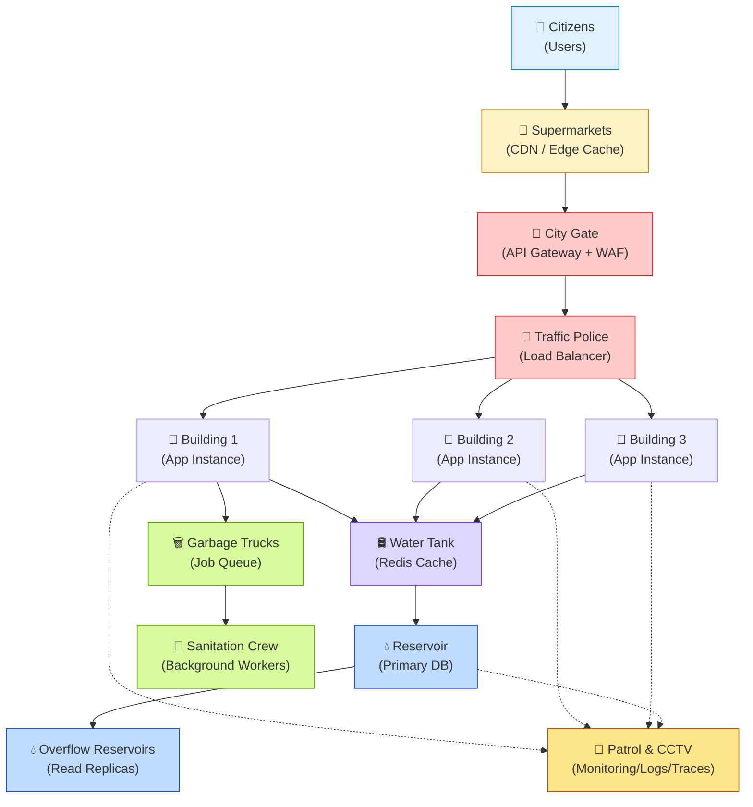

👦 **Nephew:** Okay, that's the whole game board. Now let's build it piece by piece.

---

## Part 1: Surveying the Land — Before You Build Anything

👨‍🦳 **Uncle:** No city planner pours concrete on day one. First: who's going to live here, and what do they need? For an app: what problem are you solving, what's the read/write pattern, what's your realistic user curve for year one?

This decides everything downstream:
- **Read-heavy city** (news site, product catalog) → build lots of supermarkets (caching/CDN) close to people.
- **Write-heavy city** (chat app, IoT ingestion) → invest in the water pipe network (write throughput, queues) before fancy tanks.
- **Small town starting out** → don't build a metro system for 500 people. A single well-built well (a monolith, one solid Postgres instance) will serve you for a long, long time.

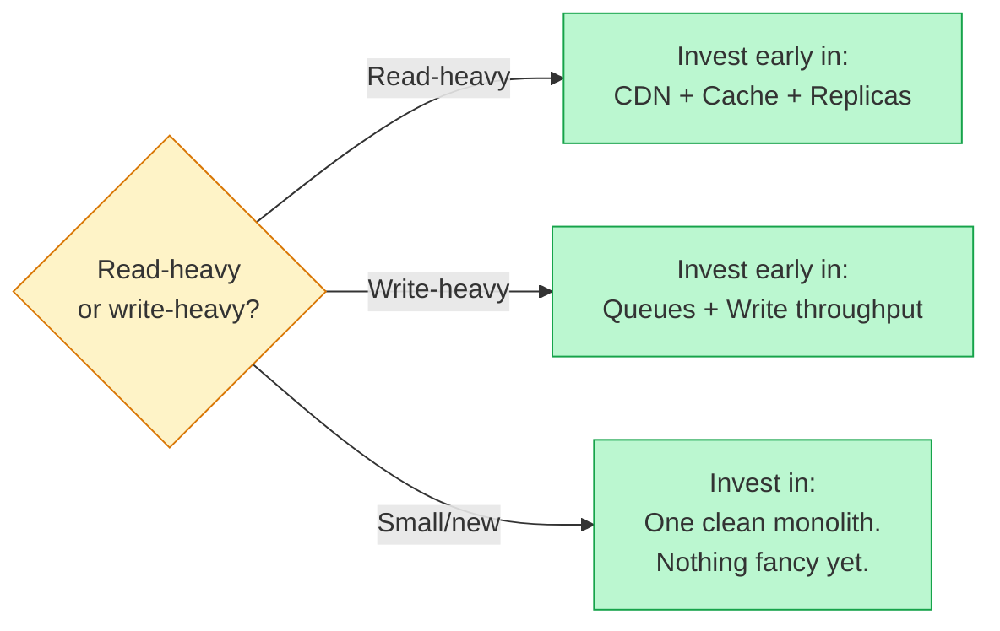

👦 **Nephew:** So we don't start with microservices?

👨‍🦳 **Uncle:** Almost never. You start with **one well-organized building** — a modular monolith, clean internal boundaries. In Node.js that means clear service/module folders (`orders/`, `users/`, `payments/`) even inside one deployable app. You split it into separate buildings (microservices) later, when one part of the city has genuinely outgrown the others and needs its own zoning. Splitting too early means you're building bridges (network calls) between buildings that didn't need to be separate — that's pure latency and operational cost for no benefit.

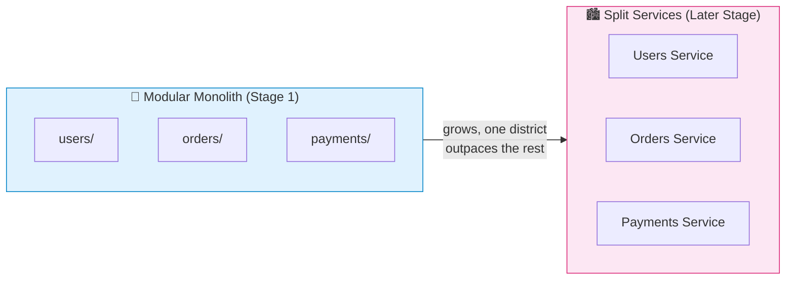

---

## Part 2: The Reservoir — Your Permanent Database

👨‍🦳 **Uncle:** Every city needs a reservoir — the source of truth. Water doesn't disappear if the tank on someone's roof runs dry; it's always in the reservoir. That's your **primary database**.

Rules I've never broken in 20 years:
1. **Pick the database for your access pattern, not for hype.** Relational (Postgres) when you have relationships and need transactions — orders, payments, inventory. Document store (MongoDB) when your data is naturally nested and schema is fluid — content, catalogs, logs.
2. **One reservoir, many pipes out.** Use **read replicas** early — the reservoir has multiple outflow pipes so half the city drawing water doesn't starve the other half. Writes go to the primary; reads get spread across replicas.
3. **Reservoir walls (backups) matter more than the water itself.** Automated daily snapshots, point-in-time recovery, and — this is the part everyone skips — **actually test restoring them** quarterly. A backup you've never restored is a rumor, not a backup.
4. **Sharding is building a second reservoir**, not a bigger one. You don't shard until a single reservoir genuinely can't hold your write volume — sharding adds huge operational complexity (cross-shard queries, rebalancing), so it's a last resort, usually only needed well past the 10-million-user mark.

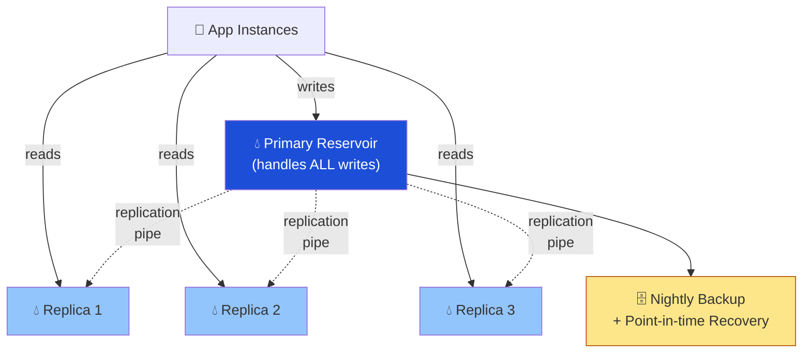

👦 **Nephew:** When do we know the reservoir is running dry?

👨‍🦳 **Uncle:** When your **write latency climbs under normal load**, or replication lag between primary and replicas starts growing during peak hours. That's your signal to shard, not "we hit a round number of users."

---

## Part 3: The Water Tank on the Roof — Caching

👨‍🦳 **Uncle:** Nobody wants to walk to the reservoir every time they need a glass of water. So every building gets a **tank on the roof** — refilled periodically, drawn from constantly. That's your **cache layer** — Redis, almost always.

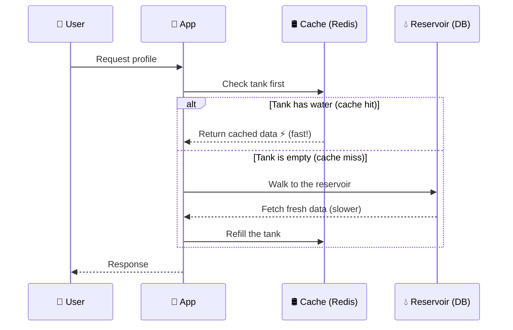

The three questions that decide *every* caching decision:

**1. What do I cache?**
Anything read far more often than it's written — a user's profile, a product page, a computed feed. Don't cache things that change every second; the tank would need refilling faster than anyone can drink from it.

**2. When does the tank go stale?**
```js
// Simple TTL — the tank auto-empties and refills from the reservoir
await redis.set(`user:${id}`, JSON.stringify(user), 'EX', 300); // 5 min
```
For data that must be exact the instant it changes (account balance), **invalidate on write** instead of waiting for TTL:
```js
async function updateUser(id, data) {
  await db.users.update(id, data);
  await redis.del(`user:${id}`); // empty the tank, next read refills from reservoir
}
```

**3. What happens when the tank is empty and 10,000 people show up at once?**
This is the famous **"thundering herd"** — cache expires, and every single request stampedes to the reservoir simultaneously, and it collapses under the sudden direct load.

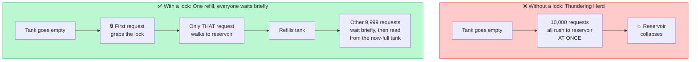

```js
// Lock so only ONE request refills the cache; others wait briefly and reread
async function getWithLock(key, fetchFn, ttl = 300) {
  let val = await redis.get(key);
  if (val) return JSON.parse(val);

  const lockKey = `lock:${key}`;
  const gotLock = await redis.set(lockKey, '1', 'NX', 'EX', 10);
  if (gotLock) {
    val = await fetchFn();
    await redis.set(key, JSON.stringify(val), 'EX', ttl);
    await redis.del(lockKey);
    return val;
  } else {
    await new Promise(r => setTimeout(r, 100));
    return getWithLock(key, fetchFn, ttl); // retry
  }
}
```

👦 **Nephew:** What if the whole tank system goes down?

👨‍🦳 **Uncle:** The city should slow down, not collapse. Your app should **degrade gracefully** — fall back to the reservoir directly with a stricter rate limit, not crash. That's the difference between an outage and an inconvenience.

---

## Part 4: Roads and Traffic Police — Load Balancers & API Gateway

👨‍🦳 **Uncle:** One building can't serve the whole city. You need roads leading to *many* identical buildings, and a traffic officer directing cars to whichever road is least jammed. That's your **load balancer** — Nginx, AWS ALB, or a cloud LB in front of your Node.js instances.

And before traffic even reaches the officer, you have a **checkpoint at the city gate** — the **API gateway**: authentication, rate limiting, request validation, all happening *before* a request wastes a single building's resources.

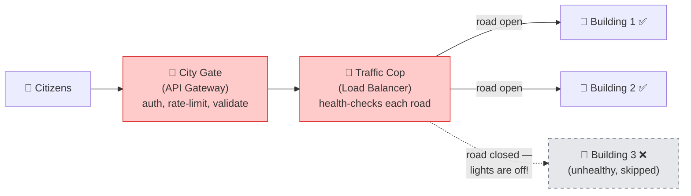

👦 **Nephew:** How does the officer decide which road?

👨‍🦳 **Uncle:** Round robin for simple cases; **least-connections** when requests vary wildly in cost (a report-generation request vs. a health check shouldn't be treated the same). And always — **health checks**. If a building's lights are off (instance unhealthy), the officer stops sending cars there until it's back.

---

## Part 5: Bus Stops and the Bus Fleet — Horizontal Scaling

👦 **Nephew:** So when traffic spikes, we just... add more buildings?

👨‍🦳 **Uncle:** Right, but think of it as a **bus system**, not fixed buildings. When rush hour hits, you don't build a new building in ten minutes — you **add more buses on the existing route**. That's **horizontal autoscaling**:

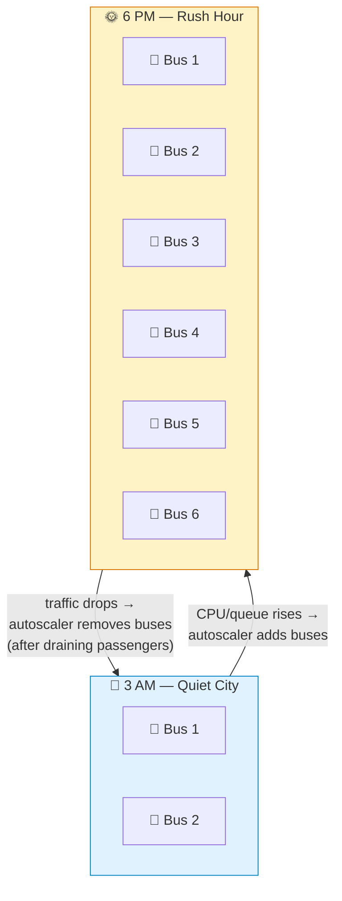

```yaml
# Kubernetes HPA — add buses when the route gets crowded
minReplicas: 3
maxReplicas: 50
metrics:
  - type: Resource
    resource:
      name: cpu
      target:
        averageUtilization: 65
```

Key rules:
- Your Node.js processes must be **stateless** — no in-memory session storage, no local file writes that matter. Any bus should be able to pick up any passenger. Session state goes in Redis, not `process.memory`.
- Scale on the metric that actually predicts trouble — usually **CPU + request queue depth**, sometimes **event loop lag** for Node specifically:
```js
const lag = require('event-loop-lag')(1000);
// if lag climbs, your single-threaded event loop is the bottleneck, not CPU%
```
- **Scale down carefully** — remove buses gradually and drain in-flight requests (`SIGTERM` handling), or you drop passengers mid-route.

👦 **Nephew:** What if one whole neighborhood — like payments — needs way more buses than the rest of the city?

👨‍🦳 **Uncle:** *That's* your real signal to split into microservices — not "microservices are modern," but "this specific district has independent traffic patterns and deserves its own bus fleet, deploy cycle, and scaling policy." Payments, notifications, search — these often peel off first because their load profile is genuinely different from the core app.

---

## Part 6: Supermarkets in Every Neighborhood — CDN & Edge Caching

👨‍🦳 **Uncle:** Nobody drives across the whole city for milk. You put a supermarket in every neighborhood. That's your **CDN** (Cloudflare, CloudFront, Fastly) — copies of your static content and even some API responses, sitting physically close to the user.

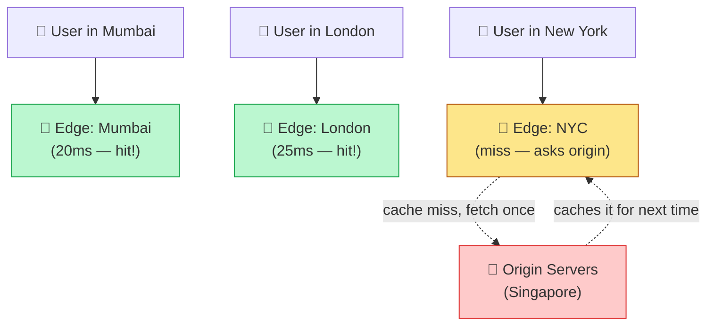

- Static assets (JS bundles, images, videos) — always through CDN, always with aggressive cache headers.
- For an app hitting global scale, even **API responses that are the same for everyone** (public product listings, article pages) belong at the edge.
- This is often the **single highest-leverage move** for both speed and cost — every request served at the edge is a request your origin servers never see, which means fewer buses needed on the actual bus route.

---

## Part 7: Garbage Trucks and Sanitation — Background Jobs & Queues

👦 **Nephew:** What about things that don't need an instant response — sending emails, generating reports, resizing images?

👨‍🦳 **Uncle:** That's sanitation. You don't make the customer wait at the counter while the garbage truck does its route. You **queue it** and let a background worker fleet handle it on its own schedule.

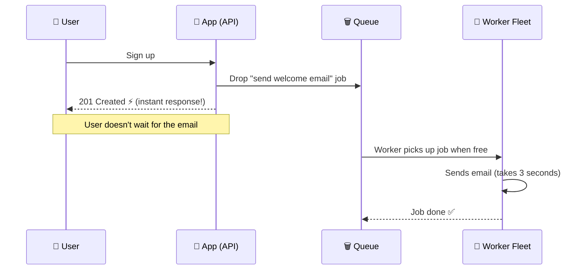

```js
// Producer — the request handler just drops the job and responds instantly
await queue.add('send-welcome-email', { userId: user.id });
res.status(201).json({ message: 'Signed up!' }); // fast response, city keeps moving

// Consumer — a separate worker fleet processes the queue
const { Worker } = require('bullmq');
new Worker('send-welcome-email', async job => {
  await emailService.send(job.data.userId);
}, { connection: redisConnection });
```

Tools: **BullMQ** (Redis-backed, great for Node), **RabbitMQ**, or **Kafka** once you need durable, high-throughput event streaming across many consuming services (analytics, notifications, audit logging all reading the same event stream independently).

👨‍🦳 **Uncle:** Think of it like an elevator button — it lights up **instantly** even though the elevator takes 30 seconds to arrive. The light is the *acknowledgment*, not the *completion*. Your API should do the same: acknowledge fast, process in the background, notify (via websocket/push/email) when actually done. Never make the user's request thread wait on the garbage truck's full route.

---

## Part 8: Police Patrol and CCTV — Monitoring, Logging, Alerting

👨‍🦳 **Uncle:** A city without patrol doesn't know a fire started until the building's already gone. **Observability is not optional past a few thousand users — it's how you find out about problems before your users tell you.**

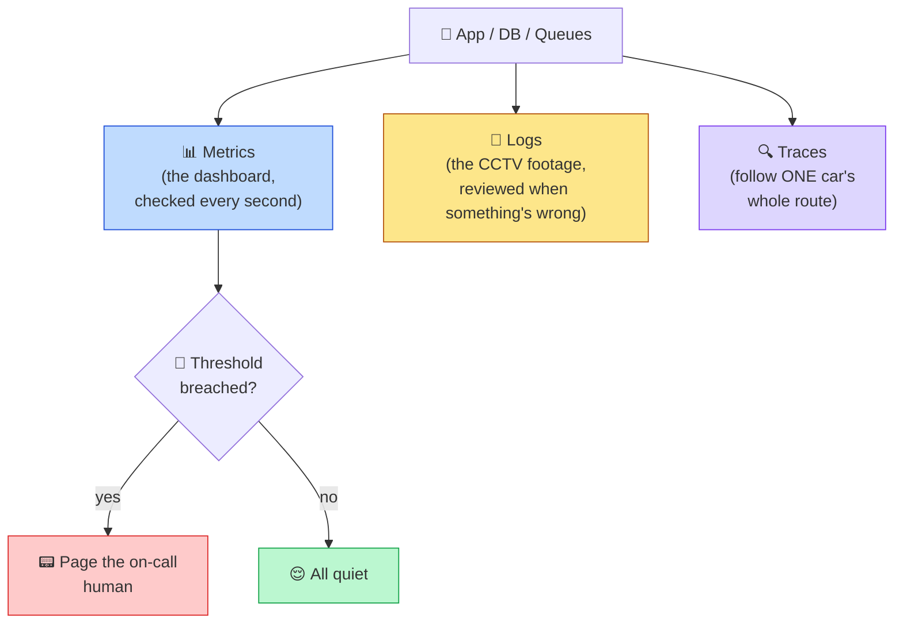

**1. Metrics — the patrol car's dashboard, checked every second.**
```js
// Prometheus-style counters/histograms
httpRequestDuration.observe({ route: req.path, method: req.method }, duration);
```
Watch: request rate, error rate, latency percentiles (p50/p95/p99 — the *tail* matters more than the average), CPU/memory, queue depth, cache hit ratio.

**2. Logs — the CCTV footage, reviewed when something's wrong.**
```js
logger.info({ event: 'order_created', userId, orderId, amount }); // structured, not console.log
```
Centralize into ELK/Datadog/CloudWatch — a log sitting only on one bus's hard drive is useless once that bus is scaled down.

**3. Traces — following one specific car's entire route across the city.**

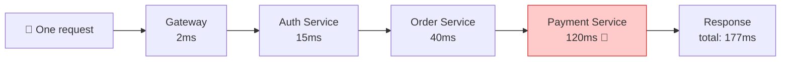

Distributed tracing (OpenTelemetry, Jaeger) — once you have multiple services, you need to see one request's full journey. Without this, debugging a slow request across 6 microservices is archaeology.

**4. Alerting — the siren that wakes someone up.**
Alert on **symptoms users feel** (error rate, latency), not just causes (CPU%). And always have a clear **on-call rotation** — a patrol with nobody watching the monitors is decoration.

👦 **Nephew:** Like a metro station announcer, constantly checking — "next train, platform status."

👨‍🦳 **Uncle:** Exactly that rhythm. Health checks every few seconds, dashboards refreshing live, and a human notified the moment the pattern breaks.

---

## Part 9: Power Grid and Backup Generators — Redundancy & Failover

👨‍🦳 **Uncle:** A city with one power plant goes dark the day that plant has a problem. Never a single point of failure — not one server, one database instance, one region.

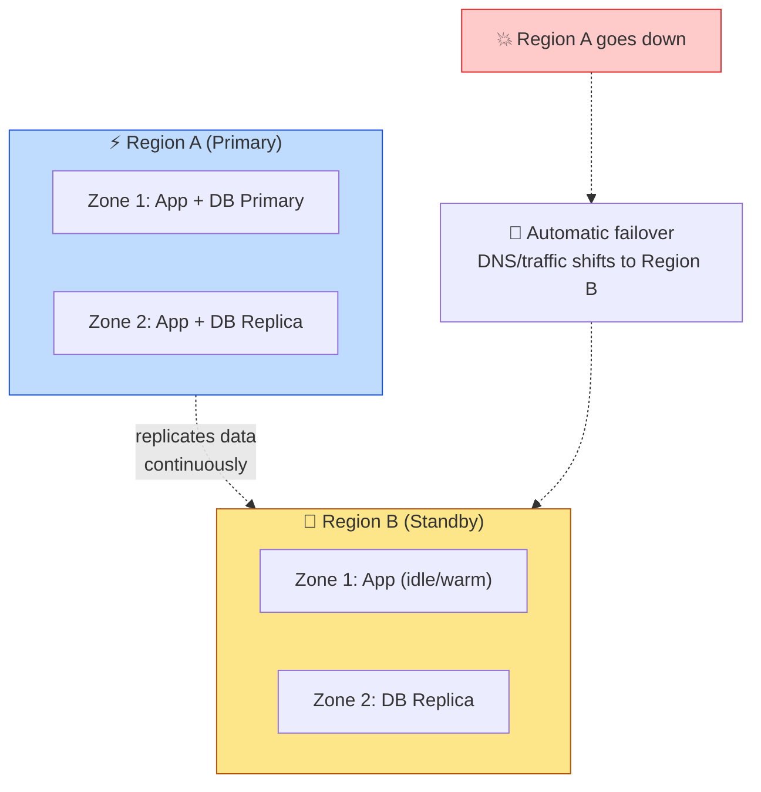

- **Multi-AZ within a region** minimum — your database and app servers spread across physically separate data centers that share a region.
- **Multi-region** once you're serving users globally at real scale — a full second city, ready to take over.
- **Automatic failover**: if the primary database dies, a replica is promoted automatically (managed services like RDS Multi-AZ, MongoDB Atlas do this for you — don't hand-roll it unless you have to).
- **Circuit breakers between services** — if the payment building's lights go out, the rest of the city shouldn't freeze; the checkout flow should fail gracefully with a clear retry message, not cascade into a citywide blackout.

---

## Part 10: The City Budget Office — Cost Management

👦 **Nephew:** All this — CDN, replicas, multi-region, monitoring stacks — sounds expensive.

👨‍🦳 **Uncle:** This is where I've seen more engineers fail than on any technical decision. **A city that overspends on infrastructure it doesn't need yet goes bankrupt before it grows.** Budget discipline:

```mermaid
flowchart LR
    A["1. Right-size<br/>before scaling out"] --> B["2. Cache aggressively<br/>— cheapest infra you own"]
    B --> C["3. Autoscale DOWN<br/>not just up"]
    C --> D["4. Reserved instances<br/>for baseline, spot for bursts"]
    D --> E["5. Storage tiering<br/>hot vs cold data"]
    E --> F["6. Cost dashboard<br/>next to latency dashboard"]

    style A fill:#d9f99d,stroke:#65a30d
    style B fill:#d9f99d,stroke:#65a30d
    style C fill:#d9f99d,stroke:#65a30d
    style D fill:#d9f99d,stroke:#65a30d
    style E fill:#d9f99d,stroke:#65a30d
    style F fill:#d9f99d,stroke:#65a30d
```

1. **Right-size before you scale-out.** A slow query that a proper index fixes is far cheaper than adding five more buses to cover for it.
2. **Cache aggressively — it's the cheapest infrastructure you own.** Every cache hit is a database query, a compute cycle, and a dollar you didn't spend.
3. **Autoscale down, not just up.** Idle buses at 3 AM cost the same as buses at rush hour if you never scale down. Set aggressive `minReplicas` at night, generous `maxReplicas` at peak.
4. **Reserved/committed instances** for your predictable baseline load; on-demand/spot only for the bursty peak on top.
5. **Storage tiering** — hot data in fast (expensive) storage, cold data (old logs, archived orders) in cheap cold storage (S3 Glacier) — don't keep everything in your expensive reservoir forever.
6. **Cost dashboards next to performance dashboards.** If your team only watches latency, cost creeps silently. I review both every week, always.

👦 **Nephew:** So the budget office and the patrol station are basically looking at the same wall.

👨‍🦳 **Uncle:** They should be. Cost is a symptom, same as latency — a spike in either tells you something about your city's health.

---

## Part 11: The City's Growth Timeline — 0 to 100 Million

👨‍🦳 **Uncle:** Now let's actually walk the growth curve, because what's *right* at each stage is different — over-engineering early is as dangerous as under-engineering late.

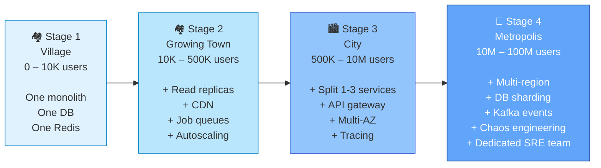

**Stage 1 — 0 to 10,000 users: The Village**
- One modular monolith, one Postgres instance, one Redis, deployed on a couple of small VMs or a single managed platform.
- No microservices. No Kafka. No multi-region. Resist every urge toward "resume-driven architecture."

**Stage 2 — 10,000 to 500,000 users: The Growing Town**
- Add read replicas. Add a proper CDN. Introduce background job queues for anything slow (emails, image processing).
- Start horizontal autoscaling for the app tier. Add structured logging and basic metrics/alerting — you can no longer eyeball problems.

**Stage 3 — 500,000 to 10 million users: The City**
- Split out the 1–3 services with genuinely different load patterns (commonly: notifications, search, payments).
- Move to a real API gateway with rate limiting per user/tier. Multi-AZ for the database. Introduce distributed tracing — debugging across services without it becomes painful here.
- Cost review becomes a weekly ritual, not an afterthought.

**Stage 4 — 10 million to 100 million users: The Metropolis**
- Multi-region active-active or active-passive, depending on your consistency needs.
- Database sharding where write volume genuinely demands it.
- Event-driven architecture (Kafka) for cross-service communication instead of direct service-to-service calls — decoupling becomes essential when dozens of teams and services exist.
- Chaos engineering — deliberately breaking parts of your own city in controlled ways to verify the backup generators actually work *before* a real outage tests them for you.
- Dedicated platform/SRE team whose entire job is the city's roads, water, and power — product engineers stop thinking about infrastructure day-to-day.

👦 **Nephew:** So the mistake is applying Stage 4 thinking at Stage 1 scale.

👨‍🦳 **Uncle:** That's the single most expensive mistake I've watched engineers make in twenty years. Build the village well. The city comes later, and it comes in layers, each one justified by a real, measured pain point — never by anticipation alone.

---

## Part 12: Emergency Services — Incident Response & Disaster Recovery

👨‍🦳 **Uncle:** Last piece. Every city, no matter how well built, eventually has a fire.

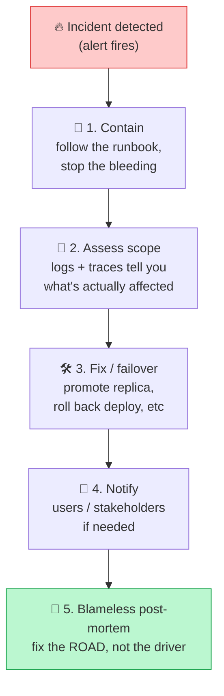

1. **Runbooks** — written before the incident, not during. "Database primary is down" should have a documented, rehearsed procedure, not a scramble.
2. **Blameless post-mortems** — the point is fixing the road that flooded, not blaming the driver who hit the pothole.
3. **Game days** — scheduled drills where you intentionally kill a service in staging (or carefully in prod) and watch whether your failover, alerting, and on-call process actually work.
4. **RTO/RPO defined per system** — how long can this be down (Recovery Time Objective), how much data can you afford to lose (Recovery Point Objective)? Payments: near-zero for both. Analytics dashboard: minutes to hours is fine. Don't spend metropolis-level redundancy budget on village-level systems.

---

## Closing: The Whole City, One Diagram

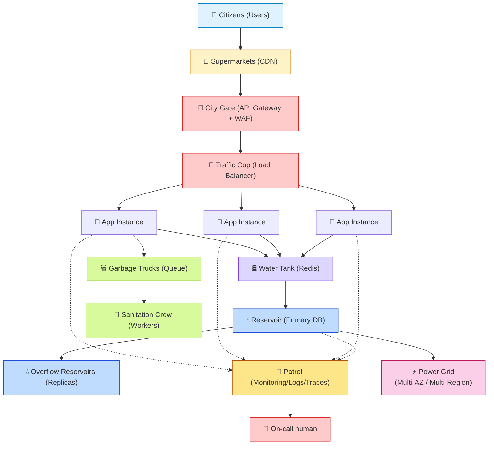

👨‍🦳 **Uncle:** That's it. That's the whole city — from a well and one building, to a metropolis with its own power grid, sanitation department, and emergency services. Twenty years, and it's still the same shape. Only the scale of each block changes.

The engineers who build cities that last aren't the ones who know the most technologies. They're the ones who know **which block to build next, and not one block before it's needed.**

Good luck out there. 🏙️

---

*End of talk.*
