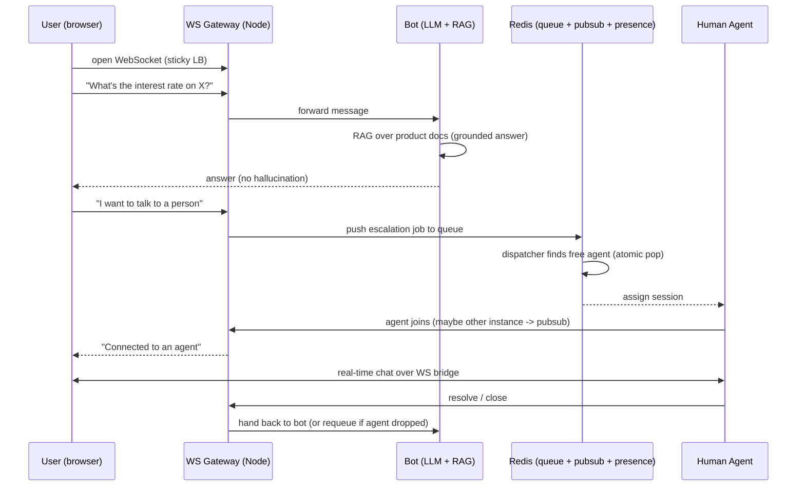
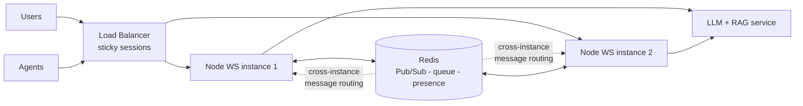
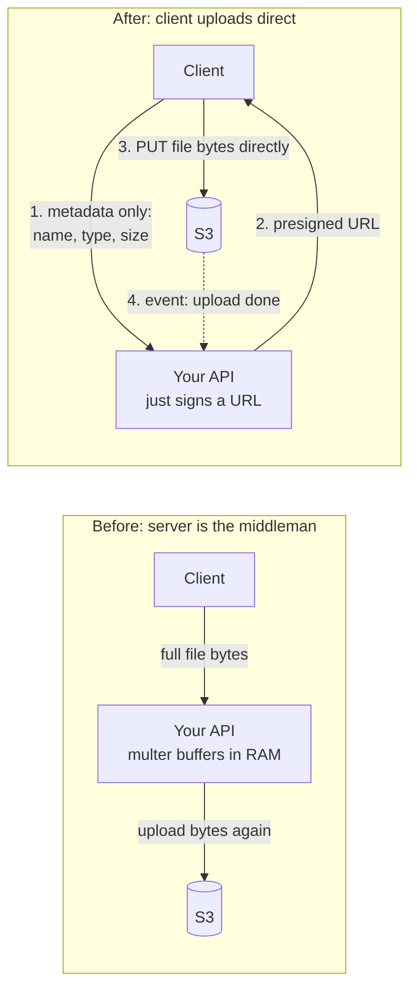
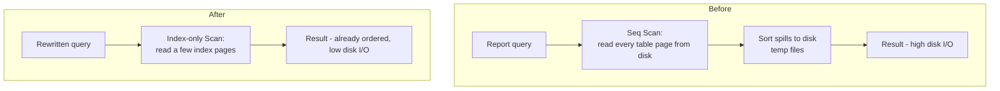
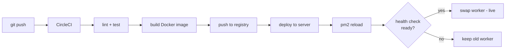
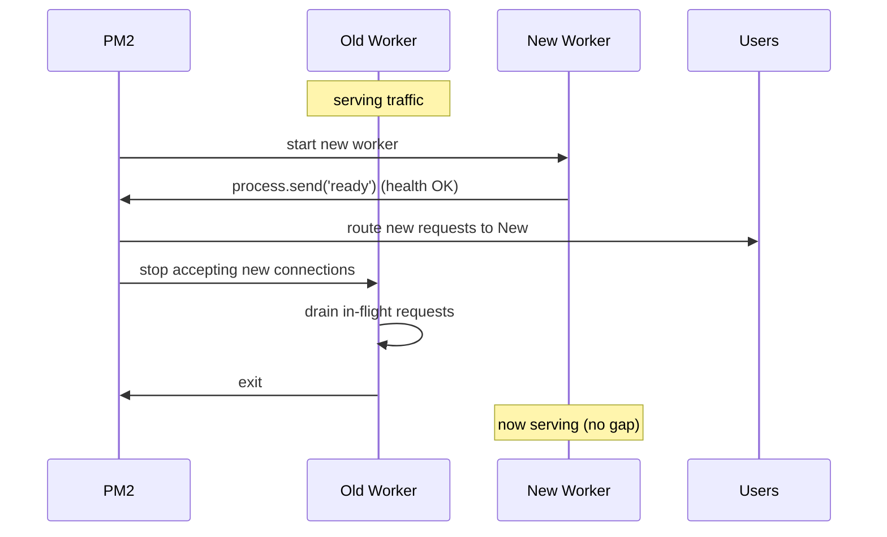

# Defending Your Advento Resume Bullets

> **Role:** Software Engineer — Advento Technologies, Hyderabad (Sep 2025 – Jan 2026), banking virtual-assistant platform.
>
> This covers two bullets interviewers *will* dig into, because they carry numbers — and numbers invite "prove it."

**Read this first — the reframing that saves you:**
**1000 concurrent WebSocket sessions is not, by itself, a hard number.** A single tuned Node process holds tens of thousands of *idle* sockets — the event loop (epoll/libuv) is built for exactly this. If you say "1000 was hard because of the connection count," a sharp interviewer pokes a hole in it. The real engineering — lead with this — is the **stateful handoff orchestration**: routing, queueing, agent assignment without races, and surviving across multiple instances. Defend *that*, not the raw socket count.

---

## Part 1 — Bot-to-Agent Escalation Flow

### The flow, said precisely (your 30-second version)

> "Users connect over a WebSocket. A bot answers them using an LLM grounded in our product docs via RAG, so it only answers from verified content instead of hallucinating. When the user explicitly asks for a human — or the bot detects it can't help / there's a high-intent signal — we raise an escalation: push the session onto a Redis queue, a dispatcher assigns it to an available human agent, and the WebSocket then bridges the user and agent in real time. When the agent resolves it or drops, the session is handed back to the bot or requeued."

### How a real system holds 1000+ concurrent sessions

**1. Why WebSockets, not HTTP polling.** HTTP is request→response; the connection closes. For a live handoff you need the server to *push* to the user the instant an agent picks up. WebSocket is one persistent, full-duplex TCP connection that stays open. So "1000 concurrent sessions" literally means **1000 open TCP connections held at once**, each with a bit of state (who the user is, are they on bot or agent, conversation buffer).

**2. Why it's I/O-bound, not CPU-bound — and why Node is fine.** Each session spends almost all its time *waiting* — waiting for the user to type, waiting on the LLM API, waiting on the agent. Node's single-threaded non-blocking event loop is ideal for many idle/waiting connections. The trap is doing heavy CPU work *inside* the event loop. You don't — the LLM/RAG call is I/O wait (you `await` it), so the loop stays free to service the other 999 sockets. **This is the core "why it scales" answer.**

**3. The actual bottleneck (say this — it shows maturity).** Not the socket count. It's: (a) per-session memory if you buffer too much state, (b) per-message work (LLM latency, DB queries), and (c) WebSockets being **sticky and stateful**, which makes horizontal scaling the genuinely hard part.

**4. Scaling past one box — the Redis insight.** A WebSocket lives on exactly *one* Node instance. The moment you run two instances behind a load balancer, a message (or agent assignment) arriving on instance A may concern a user whose socket is on instance B. Two fixes, used together:

- **Sticky load balancing** (nginx `ip_hash` or ALB sticky sessions) so a client's handshake and all later frames land on the same node.
- **Redis Pub/Sub adapter** so instances route messages to each other — instance A publishes "deliver this to user X," instance B (which holds X's socket) is subscribed and delivers it.

> The single strongest line you can say: *"WebSockets are stateful, so I used Redis Pub/Sub to fan messages across instances."* It answers "how would this scale beyond one server?"

**5. The escalation queue (Redis).** When a user needs a human:
- Push the session to a Redis queue. Use a **sorted set** for priority (VIP, wait-time) instead of plain FIFO.
- A dispatcher pops the next waiting user and assigns to an available agent.
- **Race-condition gotcha:** if two agents free up at once, both could grab the same user. Prevent with an **atomic** op — `BRPOP` / `ZPOPMIN`, a small Lua script, or a short-lived distributed lock — so a session is claimed exactly once.
- **Presence & capacity:** track which agents are online (heartbeats) and how many chats each can hold. On agent disconnect, **requeue** the abandoned user.

### Diagram — escalation sequence



### Diagram — multi-instance architecture (the "how it scales" picture)



### The "~25% latency down" claim — defend it honestly

Don't say "it just got faster." Say **what you measured and why it dropped**:

- **What you measured:** handoff latency = time from escalation trigger → user connected to a live agent. Logged a timestamp at both points; looked at p50/p95 (not just average — interviewers love p95).
- **Why it dropped ~25%:** the old path likely used polling or a DB scan to find/assign an agent (delay = poll interval + query time). Moving to **push-based delivery over the open socket + Redis presence/queue** removed the polling wait and turned agent lookup into an O(1)/O(log n) Redis op instead of a table scan. The latency you removed was *waiting and looking up*, not compute.

If they ask "average or p95?" and you have an answer, you've won the bullet.

### Gotcha questions — your one-liners

| Question | Answer |
|---|---|
| How do you detect a dead connection? | ping/pong heartbeats; no pong within timeout → close and clean up the socket (else you leak memory and get ghost sessions). |
| What if a user reconnects? | session ID in Redis; on reconnect, resume the same session and re-bind to the agent if still active. |
| What if Redis dies? | it's a single point of failure; run Redis with Sentinel/replication (HA) or Cluster. Honest to admit it's the critical dependency. |
| Two agents, one user — race? | atomic pop / lock. **Most common probe — have it ready.** |
| How do you stop hallucination before handoff? | RAG grounding + confidence gate; low confidence *itself* triggers escalation to a human. |
| Why not just scale up one big server? | vertical scaling has a ceiling and no redundancy; horizontal + Redis adapter gives both scale and failover. |

---

## Part 2 — Presigned S3 URLs

### The simple, memorable flow

**Old way — every byte flowed through your server.** Client → your API → multer buffers the whole file in memory/disk → your server validates → your server uploads to S3. Your box is a middleman carrying the luggage.

**New way — your server signs a pass; the client carries its own luggage to S3.**



**Four steps to memorize:**
1. Client tells your API *about* the file (name, type, size) — **not the bytes**.
2. API validates the metadata and returns a **presigned URL** (a signed, time-limited, single-key upload pass).
3. Client uploads the bytes **straight to S3** with that URL. Your server never touches them.
4. S3 fires an event (or the client calls back) → your API records the file key in the DB.

### Why your numbers moved

- **Server CPU down ~40%:** your API stopped parsing, buffering, and re-streaming multipart bodies. Now it just does a tiny crypto signing operation. No more multer holding multi-MB files in RAM and pegging the event loop.
- **Upload time down ~20%:** the bytes take a direct, optimized path to S3 instead of a double hop (client→server→S3). No server-side buffering bottleneck in the middle.
- **Bonus:** bandwidth on your server roughly halved (it was receiving *and* re-sending every file).

### Tradeoffs — be honest about what you GAVE UP

This is where you score points: the gain has a real cost, and a mature engineer names it.

**You lost the server-side gatekeeper.** With multer you held the actual bytes, so you *could* inspect real content (sniff true file type, scan for malware, check image dimensions) before accepting. With presigned uploads the client talks to S3 directly, so:

- You can only enforce constraints at **sign time** — real content validation moves to **after** the upload (an S3-event-triggered Lambda or backend job). Pattern: *validate metadata when signing → validate real content after upload.*
- **Accuracy point for your defense:** a plain presigned **PUT** URL does *not* strictly enforce max file size — a malicious client could exceed 5MB. To actually enforce "5MB image / 5MB PDF," use a **presigned POST policy** with a `content-length-range` condition so S3 itself rejects oversized files. If your team used plain PUT, the honest answer is "we enforced size client-side + via a post-upload check and lifecycle cleanup." **Know which one you actually did.**
- **The URL is a bearer credential:** anyone holding it can upload to that key until it expires. Mitigate with short expiry, scope to the exact object key, lock content-type, HTTPS only.
- **Orphaned objects:** client gets a URL but never finishes, or finishes but never tells your backend → files in S3 with no DB record. Handle with S3 event notifications (reliable) rather than trusting the client callback (spoofable), plus S3 lifecycle rules to sweep abandoned uploads.
- **Bucket config burden:** correct CORS on the bucket and a tight bucket policy (no accidental public access).

**The clean summary line:** *"We traded an in-line server-side validation point for much lower server load, and compensated by validating metadata at sign-time and content post-upload via S3 events."* That sentence shows you understood the cost, not just the win.

---

## One-page recall (the night before)

- **WebSockets:** persistent TCP, push not poll. 1000 is modest — the work is **stateful handoff orchestration**.
- **Why Node copes:** I/O-bound, non-blocking event loop; never block it with CPU work.
- **Scale-out secret:** WebSockets are sticky → **Redis Pub/Sub** to route across instances + sticky LB.
- **Queue:** Redis sorted set; **atomic pop** to avoid double-assigning a user.
- **25% latency:** removed polling/DB-scan lookup → push + O(1) Redis assignment; measured p50/p95.
- **Redis = single point of failure** → Sentinel/Cluster.
- **Presigned S3:** client uploads direct; server only signs. CPU ↓ because no multipart buffering.
- **S3 tradeoff:** lost in-line validation → validate metadata at sign-time, content post-upload via S3 events; enforce size with a **POST policy `content-length-range`**.

*Less noise, more reps.*

# Defending Your Advento Resume Bullets — Part 2

> Two more bullets from Advento Technologies (banking virtual-assistant platform). Same treatment: how it really works, the honest gotchas, diagrams, and a night-before recall.

**Read this first — the trap in each bullet:**
- **Query bullet:** "explicit joins" by itself does **not** reduce disk I/O. The query planner treats comma-joins and `JOIN ... ON` the same. The I/O win came from the **indexes** (and from restructuring the query). If you credit the *syntax*, a sharp interviewer catches you. Credit the indexes.
- **CI/CD bullet:** PM2 zero-downtime reload works cleanly for **stateless** apps. Your WebSocket service holds in-memory sessions — a reload drops them unless state lives in Redis. Know this nuance; it ties straight to your other bullet.

---

## Part 1 — Query Optimization (disk I/O down ~35%)

### The bullet, said precisely

> "Our report queries were doing full table scans and disk-spilling sorts. I rewrote them — making the joins explicit and restructuring the logic — and added composite indexes matching the filter and sort columns. The database went from scanning whole tables to seeking a small number of index pages, and in some cases answering from the index alone, so disk I/O dropped about 35%."

### What actually reduced the I/O

**1. Indexes turn a full scan into a seek.** Without a useful index, the DB does a **sequential scan** — it reads every page of the table off disk to find matching rows. With a matching index, it does an **index scan** — it walks a B-tree and reads only the pages it needs. Fewer pages read from disk = lower disk I/O. That's the headline.

**2. Composite (multi-column) indexes — the real lever.** A composite index on `(status, created_at)` covers queries filtering on those columns *in order*. Two rules you must know:

- **Leftmost-prefix rule:** an index on `(A, B, C)` serves `A`, `A+B`, `A+B+C` — but **not** `B` alone or `C` alone. The query must use a left prefix.
- **Column order: equality first, range last; most selective first.** For `WHERE status = 'CLOSED' AND created_at > '2025-01-01'`, the index is `(status, created_at)` — equality column (`status`) first so the range scan on `created_at` is contiguous.

**3. Covering index / index-only scan — likely your biggest I/O drop.** If the index contains *every column the query needs* (in `SELECT`, `WHERE`, and `ORDER BY`), the DB answers entirely from the index and **never touches the table heap**. No heap page reads at all — a large I/O saving on report queries.

**4. Killing a disk-spilling sort.** A big `ORDER BY` that exceeds the sort memory (`work_mem` in Postgres) spills to **temp files on disk**. A composite index in the right order returns rows already sorted, so the sort disappears — removing that disk write/read entirely.

### Diagram — before vs after



### How you'd prove the 35% (this is what they want to hear)

Use `EXPLAIN (ANALYZE, BUFFERS)` in Postgres — it shows actual page reads, not guesses:

```text
-- BEFORE
Seq Scan on reports  (cost=... rows=... )
  Buffers: shared read=12000        <- 12000 disk page reads

-- AFTER
Index Only Scan using idx_status_created on reports
  Buffers: shared hit=200 read=300  <- a few hundred pages, heap untouched
```

The `Buffers: ... read=` line is your evidence — fewer pages read = lower disk I/O. You compared before/after on a representative report. (MySQL: `EXPLAIN` / `EXPLAIN ANALYZE` showing `type: ALL` → `ref`/`range`, and `Handler_read_*` status counters.)

### Tradeoffs — be honest

- **Indexes slow down writes.** Every `INSERT`/`UPDATE`/`DELETE` must maintain the index. For a *report* table that's read-heavy and rarely written, this is a great trade — say that explicitly.
- **Indexes cost disk space and memory** (they're extra B-trees to store and cache).
- **A composite index is query-specific.** It serves *these* filter/sort columns in *this* order; a differently-shaped query may not use it. You don't index everything — you index for the actual query patterns.
- **Why not two single-column indexes?** Postgres *can* bitmap-combine them, but it's usually slower than one well-ordered composite, and single-column indexes can't give you an index-only scan or pre-sorted output for a multi-column query.

### Gotcha questions — your one-liners

| Question | Answer |
|---|---|
| How does explicit join *syntax* reduce I/O? | It doesn't by itself — planner treats them the same. The **indexes** and query restructuring did it. (Honesty scores here.) |
| Why composite, not two single indexes? | One ordered structure serves multi-column filter + sort, enables index-only scan; combining two is usually slower. |
| What decides column order? | Equality columns first, range last; most selective first. Leftmost-prefix rule governs usability. |
| Downside of adding the index? | Write overhead + disk/memory; fine for read-heavy report tables. |
| How did you find the slow query? | slow query log / `pg_stat_statements` / APM, then `EXPLAIN (ANALYZE, BUFFERS)`. |
| What's an index-only scan? | Index contains all needed columns → answer without reading the table heap → big I/O win. |

---

## Part 2 — Containerization + CircleCI + PM2 (near-zero-downtime)

### The bullet, said precisely

> "I containerized the service with Docker so every environment runs the same immutable image, set up a CircleCI pipeline that builds, tests, and ships that image on every push, and ran the app under PM2 in cluster mode. Deploys use `pm2 reload`, which restarts workers one at a time and waits for a health-check ready signal before swapping — so requests keep being served throughout, giving near-zero-downtime releases."

### How each piece works

**1. Docker — the repeatable artifact.** The image bundles app + dependencies + runtime, so dev, staging, and prod run identically ("works on my machine" disappears). The image is immutable and tagged by version, which makes **rollback** trivial: redeploy the previous tag.

**2. CircleCI — the repeatable pipeline.** On every push, `.circleci/config.yml` runs the same steps automatically: install → lint → test → build image → push to registry → deploy. "Repeatable releases" = no manual steps, no human forgetting a command, no environment drift. CI catches breakage *before* it ships.

**3. PM2 — process management + clustering.**
- **Cluster mode** forks N workers (one per CPU core) sharing the same port → uses all cores *and* enables rolling restarts.
- **`pm2 reload` vs `pm2 restart`:** `restart` kills everything and brings it back → a downtime gap. **`reload`** restarts workers **one at a time** — the old worker keeps serving until the new one is ready, then drains and exits. No moment where zero workers are up.

**4. Health checks — what makes it actually safe.** A worker being *running* isn't the same as being *ready* (DB connected, caches warm). With PM2 `wait_ready` + `process.send('ready')`, PM2 waits for the app to signal readiness before adding it to rotation and killing the old worker. That's the difference between "near-zero-downtime" and "dropped requests during deploy."

### Diagram — CI/CD pipeline



### Diagram — near-zero-downtime reload



### Why "near"-zero, not zero — and the WebSocket catch

- **Why "near":** in-flight requests during the swap, connection-draining timeouts, and sticky connections mean a tiny edge always exists. Claiming literal zero is a red flag; "near-zero" is the honest, correct word.
- **The WebSocket nuance (important — they may connect your bullets):** PM2 reload cleanly works for **stateless HTTP**. Your WebSocket service holds **in-memory session state**, so reloading a worker **drops its open sockets** — clients must reconnect. The clean fix is exactly what you did elsewhere: **externalize session/presence state to Redis** so a reconnect resumes the session. Be ready to say "for the stateful WS path, reload drops sockets, so clients reconnect and resume from Redis state."

### Tradeoffs — be honest

- **PM2 cluster inside Docker is debatable.** The "Docker way" is one process per container, with the orchestrator (e.g. Kubernetes rolling updates) handling clustering and zero-downtime. Running PM2 cluster *inside* a container duplicates that responsibility. Your honest justification: it was **pragmatic for the infra you had** (single VM/EC2-style deploy) and gave in-host clustering + graceful reload without taking on Kubernetes complexity.
- **Graceful shutdown must be implemented.** Zero-downtime only holds if the app handles `SIGINT`/`SIGTERM` — stop accepting new work, finish in-flight, then exit. Without it, reload still drops requests.
- **CI/CD costs:** build minutes, secret management, and flaky tests can block deploys — you keep the suite fast and reliable.

### Gotcha questions — your one-liners

| Question | Answer |
|---|---|
| `reload` vs `restart`? | reload = graceful, one worker at a time; restart = hard kill-all with a gap. |
| How does the health check enable zero-downtime? | PM2 waits for the app's `ready` signal before swapping; old worker keeps serving until new one is confirmed up. |
| What happens to WebSocket sessions on reload? | They drop unless state is in Redis; clients reconnect and resume. (Honesty + ties bullets.) |
| How do you roll back? | redeploy the previous immutable image tag. |
| Why Docker at all? | environment parity + immutable, versioned, rollback-able artifact. |
| PM2 cluster in Docker — anti-pattern? | acknowledge it; justify by infra simplicity vs full Kubernetes. |
| What if a worker crashes at runtime? | PM2 auto-restarts it; cluster mode means other workers keep serving meanwhile. |

---

## One-page recall (the night before)

**Query optimization**
- Indexes turn **seq scan → index seek**: fewer disk pages read = lower I/O.
- **Composite index:** leftmost-prefix rule; equality first, range last; most selective first.
- **Index-only scan** (covering index) = answer without touching the heap → biggest I/O win.
- Right-ordered index **removes a disk-spilling sort**.
- Proof = `EXPLAIN (ANALYZE, BUFFERS)`, compare `shared read=` before/after.
- Honest: **explicit join syntax alone changes nothing** — indexes did it.
- Tradeoff: indexes slow writes + cost space; fine for read-heavy report tables.

**CI/CD + PM2**
- Docker = immutable, identical-everywhere artifact; rollback = redeploy old tag.
- CircleCI = same automated build/test/ship on every push = repeatable, no human error.
- PM2 cluster = all cores + rolling restarts; **`reload` not `restart`**.
- Health check (`wait_ready` + `process.send('ready')`) = swap only after new worker is truly ready → near-zero-downtime.
- "Near" because of in-flight requests; needs graceful `SIGTERM` shutdown.
- **WebSocket catch:** reload drops in-memory sockets → externalize to Redis, clients reconnect.
- Honest tradeoff: PM2-in-Docker vs Kubernetes rolling update — pragmatic for single-VM infra.

*Less noise, more reps.*