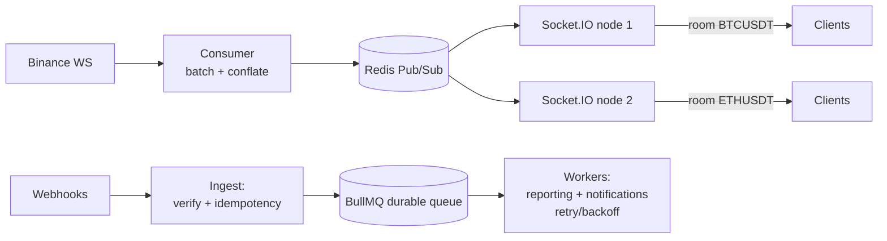
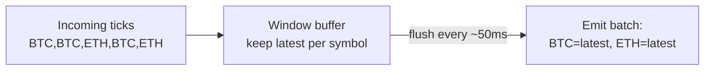
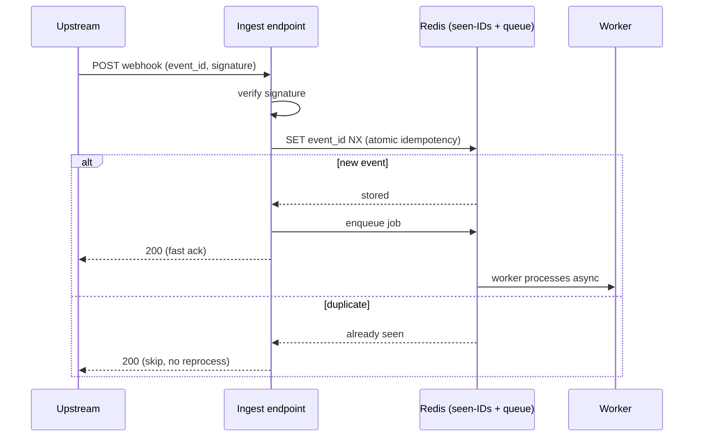

# Defending Your Technoloader Resume Bullets

> **Role:** Full Stack Engineer — Technoloader Pvt Ltd, Jaipur (May 2024 – Jul 2025), real-time trading platform.
>
> Five bullets here, but they tell **one story**. Lead the interview with that story, then defend each piece.

## The one-sentence story that ties all five together

> "The real-time price path is sacred — it has to stay low-latency. So I optimized that path (filtered fan-out + batching) and pushed everything heavy or bursty *off* it (webhooks and reporting into durable queues and separate workers). The result was a system that sustained mixed load without the slow jobs ever touching the fast path."

If you say that first, the five bullets become "here's how I did each part" instead of five disconnected claims.

**Two honest reframings to keep you out of traps:**
- **10K events/min ≈ 167/sec — that's modest in absolute terms.** Don't claim it was hard because of raw volume. The engineering was **workload isolation** — keeping three very different workloads from interfering. Say that.
- **One Redis, two different tools for two different guarantees.** Market data uses **pub/sub** (ephemeral, fan-out, latest-wins). Webhooks/jobs use a **durable queue / BullMQ** (persistent, at-least-once). Knowing *why* you used each is the strongest thing you can demonstrate.

---

## The architecture (draw this on the whiteboard)

Left half = the **fast path**. Right half = the **offloaded path**. They share Redis but never block each other.

---

## Bullet 1 — Filtered Binance data over Socket.IO + Redis pub/sub fan-out

### Said precisely

> "We consume Binance once and fan it out to many clients. Clients subscribe to specific symbols, which maps to Socket.IO rooms, so a tick for BTCUSDT is emitted only to the room of clients who asked for it. Redis pub/sub carries the data across Socket.IO instances, since each client's socket lives on one node."

### How it works

**1. One upstream, many downstream (the fan-out problem).** You hold **one** connection to Binance per stream — not one per client. Why: Binance has connection/rate limits, and per-client connections would be redundant, unfilterable, and impossible to add business logic to. Consume once, distribute many.

**2. Per-symbol filtering = Socket.IO rooms.** When a client subscribes to `BTCUSDT`, it **joins the room** `BTCUSDT`. When a `BTCUSDT` tick arrives, you `emit` to that room only. Clients never receive symbols they didn't ask for — saving bandwidth and client-side CPU. That's the "each session receives only the symbols it subscribed to" mechanism.

**3. Cross-instance fan-out = Redis pub/sub.** Socket.IO is **stateful** — a socket lives on exactly one server. With multiple servers, the instance consuming Binance publishes ticks to Redis; every Socket.IO instance is subscribed and delivers to its local room members. (Same scaling insight as a chat system: stateful sockets → Redis adapter to bridge instances.)

**4. Upstream subscription multiplexing.** If 500 clients want BTCUSDT, you still keep **one** Binance subscription for it and fan out internally. You only open/close upstream streams based on whether *anyone* wants a symbol.

### Gotchas

| Question | Answer |
|---|---|
| Why not let clients connect to Binance directly? | Rate/connection limits, no server-side filtering or business logic, can't multiplex, exposes you to upstream directly. |
| How does per-symbol filtering work? | Socket.IO rooms — subscribe = join room, emit to room only. |
| How does it scale to multiple servers? | Socket.IO is sticky/stateful → Redis pub/sub adapter bridges instances. |
| 500 clients want BTCUSDT — 500 Binance streams? | No — one upstream subscription per symbol, fanned out internally. |
| Why pub/sub and not a durable queue here? | Live prices are latest-wins and ephemeral; you want the newest value, not a replay of missed ones. Pub/sub fits; durability would be wasted cost. |

---

## Bullet 2 — Batched event pipeline (consumer CPU down ~30%, same freshness)

### Said precisely

> "Processing every Binance message individually meant a serialize-and-emit per tick, and each emit carries serialization + room fan-out overhead. I batched events into a short time window and conflated to the latest value per symbol, then flushed the batch. Far fewer emit operations dropped consumer CPU ~30%, and because each flush carries the freshest value, per-tick freshness was unchanged."

### Why CPU dropped — and why freshness didn't

**Per-event work is expensive at volume.** Each individual emit means: JSON serialization + room lookup + framing + an event-loop turn. Multiply by hundreds of ticks/sec and the overhead dominates. **Batching amortizes it** — one serialization pass, one flush, far fewer operations.

**Conflation is the key to "same freshness."** Within a small window (say 50–100ms) you keep only the **latest** value per symbol and drop the superseded intermediate ticks. The value the client receives is just as current as before — you only removed redundant updates the UI could never have rendered anyway (a screen refreshing at 60fps gains nothing from 500 updates/sec). So: fewer emits, same newest price = lower CPU at equal freshness.

### The honest nuance (have this ready)

Conflation is correct for **price/ticker** display — but **not** for data where every event matters: order-book deltas (each delta must be applied in sequence) or trade streams used to build candles/volume. Be precise: *"conflation applied to display ticks; completeness-critical streams weren't conflated."* If you skip this and they ask about order-book accuracy, the bullet looks naive.

### Gotchas

| Question | Answer |
|---|---|
| Doesn't batching add latency? | Up to the window (~50ms) — negligible for UI, and freshness is preserved by sending the latest value. |
| Why is per-event emit costly? | Serialization + room fan-out + event-loop turn per call; batching amortizes it. |
| How did you measure 30%? | Process CPU under the same event load before/after — `process.cpuUsage()` / `pidstat` / APM. |
| What about order-book / trade data? | Not conflated — those need ordered, complete application. Only display ticks were batched. |

---

## Bullet 3 — Sustained 10K+ events/min under concurrent load

### Said precisely

> "Live price updates, webhook ingestion, and reporting all ran at once. ~10K events/min isn't large in absolute terms — the point was isolation: the bursty webhooks and the heavy reporting never contended with the latency-critical price path, because each ran through its own queue and workers."

### How to defend it

This bullet is a **capacity + isolation** claim, not a raw-throughput brag. Defend it with:
- **What you measured:** event counters per workload + load testing under concurrent traffic; you watched the price-path latency stay flat while webhook/report load rose.
- **Why it held:** the fast path does almost nothing per tick (batch + emit); everything expensive is offloaded (bullets 4 and 5). So adding report/webhook load doesn't steal time from the price path.
- **Where it'd break at higher scale (say this — it shows you know the limits):** the single Binance consumer, Redis pub/sub throughput, Socket.IO fan-out, and DB write capacity for reporting are the next bottlenecks; you'd shard consumers, scale Redis, and add Socket.IO instances.

### Gotchas

| Question | Answer |
|---|---|
| Is 10K/min a lot? | ~167/sec — modest; the engineering was workload isolation, not volume. |
| What kept the price path fast under load? | Heavy/bursty work offloaded to durable queues + separate workers (bullets 4, 5). |
| First bottleneck if you 10×'d it? | Single consumer / Redis throughput / DB writes — shard and scale horizontally. |

---

## Bullet 4 — Hardened webhook ingestion (idempotency + buffered queue, no dropped events)

### Said precisely

> "Webhook senders retry on timeout, so duplicates are guaranteed, and bursts can overwhelm synchronous handlers. I verify the signature, do an atomic idempotency check on the event ID, enqueue to a durable buffer, and return 200 fast. A worker drains the queue at its own pace — so bursts are absorbed by the queue instead of dropped, and duplicates are skipped instead of double-processed."

### The two mechanisms — and how they interlock

**Idempotency** = processing the same event twice has the same effect as once. Each webhook has a unique ID; you record seen IDs and skip duplicates. In a *trading/finance* context this is non-negotiable — double-processing an event could double-count a trade or payment.

**Buffered queue + fast-ack** = you don't process inside the HTTP handler (which blocks and drops under burst). You validate, enqueue, return 200 immediately. The queue is the shock absorber; the worker drains it steadily. "No dropped events" because you ack fast and the durable queue holds the backlog.

**The elegant interlock (say this):** fast-ack + durable queue gives you **at-least-once** delivery → which *guarantees* occasional duplicates → which is exactly why **idempotency** is required. The two features aren't separate niceties; one makes the other safe.

### Gotchas

| Question | Answer |
|---|---|
| Why idempotency? | Senders retry → duplicates → without it you double-count (a finance disaster). |
| Where do you store seen IDs? | Redis `SET NX` with TTL (fast) and/or a DB unique constraint (durable). Tradeoff: Redis fast but ephemeral; DB durable but slower. |
| Two duplicates arrive at the same instant — race? | Atomic check-and-set (`SET NX`) or a DB unique constraint; the second loses the race and is skipped. |
| Why return 200 before processing? | Decouple ingestion from processing so bursts don't drop — but the queue must be durable so you don't ack then lose it. |
| What if the queue fills up? | Bounded queue + backpressure + alerting; BullMQ is Redis-backed so it survives restarts. |

---

## Bullet 5 — Offloaded reporting & notifications to BullMQ workers (retry/backoff)

### Said precisely

> "Reports and notifications are slow and resource-heavy. Doing them inline would steal CPU and event-loop time from the price path. So the stream process just enqueues a BullMQ job and moves on; separate worker processes do the heavy lifting, with retry and exponential backoff so transient failures self-heal, and a failed queue for anything that exhausts retries."

### Why a queue, not just async

A common interview trap: *"why not just `await` it asynchronously in the same process?"* Because **async still runs on the same process** — same CPU, same event loop, same memory. A separate **worker process** gives true resource isolation **plus** durability, controlled concurrency, retries, and survival across restarts. That isolation is what keeps the price path fast (and is what makes bullet 3 true).

**Retry with exponential backoff** = on transient failure (email service down, DB timeout), retry after growing delays (with jitter) instead of hammering the failing dependency. After max attempts → a **failed/dead-letter queue** for inspection + alerting.

**Jobs must be idempotent too** — retries mean a job may run more than once, so "send notification" must not send twice. Same idempotency theme as bullet 4; worth naming the consistency.

### Gotchas

| Question | Answer |
|---|---|
| Why a queue instead of async/await? | Async shares the same process's CPU/loop/memory; a worker isolates resources + adds durability, retries, concurrency control. |
| Why exponential backoff (with jitter)? | Avoid hammering a recovering dependency and avoid synchronized retry storms. |
| Job keeps failing? | Max attempts → failed/dead-letter queue + alert. |
| Aren't retries dangerous? | Yes if non-idempotent — jobs are written to be safe to re-run. |
| How do workers scale? | Add worker processes / raise concurrency; Redis coordinates the queue. |

---

## One-page recall (the night before)

**The story:** fast path is sacred; push everything heavy/bursty off it. Pub/sub for ephemeral market data, durable queue for must-not-drop events.

- **Fan-out (B1):** one Binance connection → Socket.IO **rooms** for per-symbol filtering → **Redis pub/sub** to bridge stateful instances. Multiplex upstream (one stream per symbol, not per client).
- **Batching (B2):** per-event emit is costly (serialize + room fan-out). Batch + **conflate to latest per symbol** → CPU ↓ ~30%, freshness unchanged. *Not* applied to order-book/trade streams (need ordered completeness).
- **Capacity (B3):** 10K/min ≈ 167/sec — modest; the win was **isolation**, not volume. Next bottlenecks: single consumer, Redis, DB writes.
- **Webhooks (B4):** verify → **atomic idempotency** (`SET NX` / DB unique) → **fast-ack + durable buffer** → worker drains. At-least-once → duplicates → that's *why* idempotency is needed.
- **Offload (B5):** **BullMQ** workers for reporting/notifications, **retry + exponential backoff + jitter**, dead-letter on exhaustion. Async ≠ isolation — a separate process is. Jobs idempotent because retries re-run them.

**Reusable line across multiple bullets:** *"Stateful sockets live on one node, so Redis pub/sub bridges instances."* (Works for this role and your banking WebSocket bullet.)

*Less noise, more reps.*