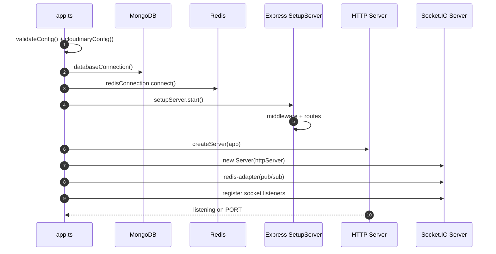
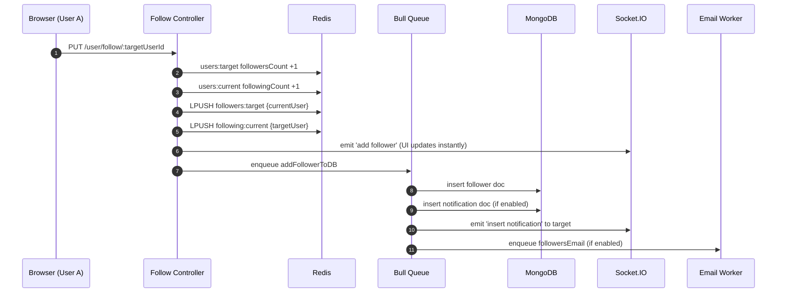

# Chatty Backend — Engineering Deep Dive (Interview Notes)

> Generated from the codebase in `chatty-backend-develop.zip` (Node.js + TypeScript + Express + MongoDB + Redis + Bull + Socket.IO).  
> Date: January 24, 2026

---

## 0) One-paragraph “tell this in interviews”

This backend is a **feature‑based monolith** (auth, posts, comments, reactions, followers, chat, notifications, images, users). It uses **MongoDB** as the source of truth, **Redis** for low‑latency reads and fast counters, **Bull (Redis-backed queues)** for async work (DB writes, emails, image metadata) to keep API responses snappy, and **Socket.IO** for real‑time updates (new posts, reactions, follows, chat messages, notifications). To scale horizontally, Socket.IO uses a **Redis pub/sub adapter** so events emitted from one Node process reach clients connected to other processes.

---

## 1) Startup: what happens when the server boots

### 1.1 Startup sequence (what runs first)

From `src/app.ts`:

1. **Load config + validate env**: `config.validateConfig()` and `config.cloudinaryConfig()`
2. **Connect to MongoDB**: `databaseConnection()` (`src/setupDatabase.ts`)
3. **Connect to Redis**: `redisConnection.connect()` (`src/shared/services/redis/redis.connection.ts`)
4. **Build Express app**: `server.start()` → `setupServer.start()` (`src/server.ts`, `src/setupServer.ts`)
5. **Create HTTP server + attach Socket.IO**: `createServer(app)` + `new Server(httpServer, ...)`
6. **Attach Socket.IO handlers**: post/follower/user/chat socket modules call `.listen()`

### 1.2 Diagram: boot flow



---

## 2) Why these packages exist (what problem each solves)

Below are the ones you asked + a few that are tightly related to interview explanation.

### 2.1 Jest (tests)

**What it is:** a test runner + assertion library (unit/integration tests).  
**Why used here:** you have controller tests under many features (e.g. `src/features/auth/controllers/test/...`). Jest makes it easy to:
- mock services (`jest.spyOn(...)`)
- run TypeScript tests via **ts-jest**
- run in CI

**Interview line:** “I wrote controller tests with Jest + ts-jest, spying on cache/queue calls to validate side effects without hitting real Redis/Mongo.”

### 2.2 Bull (job queue)

**What it is:** a **Redis-backed job queue**: enqueue work in API process, process it later in worker(s).  
**Why used here:** to keep request latency low and make heavy/slow tasks reliable:
- **DB writes** for posts, followers, chat messages are queued
- **emails** are queued
- some image metadata writes are queued

Bull also supports:
- retries + backoff
- concurrency
- delayed jobs
- metrics / dashboard (`@bull-board/express`)

**Interview line:** “I used Bull for async tasks so the API can respond immediately, and workers handle DB writes + emails with retries.”

> Important tradeoff: in this codebase, queue processors are registered inside the app process (queues are imported by controllers). That means **API servers are also workers** unless you separate them into dedicated worker processes.

### 2.3 Joi (validation)

**What it is:** runtime schema validation library for request bodies.  
**Why used here:** TypeScript types don’t validate untrusted user input. Joi prevents bad payloads from reaching business logic.

You use it through a decorator: `@joiValidation(schema)` (see `src/shared/globals/decorators/joi-validation.decorators.ts`).

**Interview line:** “I validated inbound payloads with Joi at the controller boundary to enforce contracts and reduce runtime errors.”

### 2.4 Helmet (security headers)

**What it is:** Express middleware that sets security-related HTTP headers.  
**Why used here:** protects against common web attacks and hardens default headers (e.g. clickjacking, MIME sniffing, etc.).

**Interview line:** “Helmet hardens HTTP headers out of the box — good baseline security.”

### 2.5 Compression (what you called ‘copressor’)

**What it is:** response compression middleware (gzip / brotli depending on environment).  
**Why used here:** reduces response payload size → faster responses and lower bandwidth cost.

**Tradeoff:** adds CPU overhead; for already-compressed media (images/videos), benefit is small.

---

## 3) Your specific questions (answered from the code)

### 3.1 `app.set('trust proxy', 1)` — what is it?

In `src/setupServer.ts`:

```ts
app.set('trust proxy', 1);
```

**Meaning:** Express is told it sits **behind a proxy** (like Nginx / AWS ALB / Cloudflare).  
When enabled, Express trusts `X-Forwarded-*` headers to determine:
- client IP (`req.ip`)
- protocol (`https` vs `http`)
- secure cookies behavior

**Why `1`?** It means “trust the **first** proxy hop”. Common setup: one load balancer in front of Node.

**Why you need it:** because you use `cookie-session` with `secure: config.NODE_ENV !== 'development'`.  
If you’re behind a TLS-terminating proxy, your Node app sees incoming traffic as HTTP unless it trusts the proxy — so cookies might not be set correctly unless `trust proxy` is configured.

### 3.2 Why these 3 lines?

```ts
app.use(compression());
app.use(json({ limit: '50mb' }));
app.use(urlencoded({ extended: true, limit: '50mb' }));
```

- `compression()`  
  Compresses **responses** (server → client). Better speed and bandwidth.  
  Not related to parsing request body.

- `json({ limit: '50mb' })`  
  Parses incoming request bodies with `Content-Type: application/json`.  
  The 50MB limit is large because the app sometimes sends **base64 images** (avatarImage, selectedImage, etc.).

- `urlencoded({ extended: true, limit: '50mb' })`  
  Parses `application/x-www-form-urlencoded` bodies (HTML form style).  
  `extended: true` allows nested objects (uses `qs` library).  
  Same 50MB reason: large payloads.

**Interview tradeoff:** large body limits can be abused → pair with rate limits + validation + uploads. If you move to direct uploads (S3/Cloudinary), you can reduce limits.

### 3.3 Redis pub/sub clients — “we don’t use this anywhere”

In `createSocketIO()` inside `src/setupServer.ts`:

```ts
const pubClient = createClient({ url: config.REDIS_HOST });
const subClient = pubClient.duplicate();
await Promise.all([pubClient.connect(), subClient.connect()]);
io.adapter(createAdapter(pubClient, subClient));
```

**This is used by Socket.IO.**  
`@socket.io/redis-adapter` uses Redis **pub/sub** so that if you run multiple Node instances (PM2 cluster / Docker replicas), an event emitted in instance A can reach clients connected to instance B.

**Without it:** broadcasts only reach users connected to the same Node process.  
**With it:** real-time works across horizontal scaling.

### 3.4 “Why so many socket connections? postSocket, followerSocket, userSocket…”

You **do not create multiple network connections**. There is **one Socket.IO server** (`io`) and each browser creates **one WebSocket** connection.

What you have are **multiple handler modules** registering their own listeners:

```ts
new SocketIOPostHandler(io).listen();
new SocketIOFollowerHandler(io).listen();
new SocketIOUserHandler(io).listen();
new SocketIOChatHandler(io).listen();
```

Each `.listen()` calls `io.on('connection', (socket) => { ... })`.

**Reason:** separation of concerns (clean modular code).  
**Tradeoff:** every new connection triggers multiple callbacks (one per handler). It’s usually fine, but you can centralize to a single `io.on('connection')`.

### 3.5 Why only these two use `listen(io)`?

```ts
notificationSocketHandler.listen(io);
imageSocketHandler.listen(io);
```

Those two modules (`src/shared/sockets/notification.ts` and `image.ts`) don’t set up `io.on('connection')` listeners.  
They only store the `io` object into a module-level variable (exported), so other parts of the app can do:

```ts
socketIONotificationObject.emit(...)
socketIOImageObject.emit(...)
```

**So they’re “special” because they exist mainly to expose a shared `io` emitter** — not to handle client events.

### 3.6 In workers: `const { keyOne, keyTwo, type } = job.data;` — what are these?

These are **generic payload fields** used by different jobs. Examples:

- Post delete job: `postQueue.addPostJob('deletePostFromDB', { keyOne: postId, keyTwo: userId })`  
  → in worker: `keyOne=postId`, `keyTwo=userId`

- Block user job: `{ keyOne: currentUserId, keyTwo: otherUserId, type: 'block' | 'unblock' }`

So:
- `keyOne` is usually the **primary identifier** (postId / userId depending on job)
- `keyTwo` is the **secondary identifier** (other user id / actor id)
- `type` is a **mode switch** (e.g. block vs unblock)

**Interview note:** rename these to meaningful fields (e.g. `actorId`, `targetId`) to reduce confusion.

---

## 4) End-to-end: how follow → notification → realtime update works

### 4.1 Concepts: follower vs followee (important)

In the DB schema (`Follower` collection):
- `followerId` = the user who **follows**
- `followeeId` = the user who is **being followed**

So if **Suraj follows Rahul**:
- followerId = Suraj
- followeeId = Rahul

> In `follower-user.ts` the route param is called `:followerId` but it is used as the **target user id** (the followee). The naming is confusing; conceptually it is the **user being followed**.

### 4.2 Follow flow (what the code does)

In `src/features/followers/controllers/follower-user.ts`:

1. Increment counts in Redis (two updates):
   - target user’s `followersCount` +1
   - current user’s `followingCount` +1
2. Read both user objects from cache (`UserCache.getUserFromCache`)
3. Emit realtime event: `'add follower'`
4. Write relationship into Redis lists:
   - `following:{currentUserId}` list gets `{ _id: targetUserId, ... }`
   - `followers:{targetUserId}` list gets `{ _id: currentUserId, ... }`
5. Queue DB write with Bull: `followerQueue.addFollowerJob('addFollowerToDB', ...)`

Then in the DB service (`src/shared/services/db/follower.service.ts`):

6. Check receiver’s notification settings from cached user
7. If enabled:
   - insert notification in Mongo
   - emit `'insert notification'` to the target user (payload includes `{ userTo: followeeId }`)
8. Queue an email job for follow notification (if enabled)

### 4.3 Diagram: follow sequence



### 4.4 How UI updates instantly (your question)

Because the controller emits Socket.IO **before** the DB write finishes:

```ts
socketIOFollowerObject.emit('add follower', addFolloweeData);
```

Frontend can update follower count / follow button state immediately.

**Tradeoff:** if the DB job fails permanently, UI showed success but DB is inconsistent. The code relies on Bull retries, but there’s no reconciliation if retries exhaust.

---

## 5) Redis caching strategy (what’s actually implemented)

### 5.1 Pattern used

Mostly **write-through / write-around hybrid**:
- On writes (create post, follow, send message) the API writes to **Redis immediately** and enqueues Mongo writes.
- On reads, it tries Redis; if empty, it falls back to Mongo (**cache-aside**).

### 5.2 Redis data structures used (what + why)

- **Hash**: `users:{userId}`, `posts:{postId}`  
  Fast partial reads (`HMGET`) and counter updates (followersCount/postsCount, etc.)
- **List**: `followers:{userId}`, `following:{userId}`, `comments:{postId}`, `reactions:{postId}`, `messages:{conversationId}`  
  Append/push semantics for timelines/history
- **Sorted Set**: `user`, `post`  
  Pagination / ordering by score

### 5.3 TTL / LRU / LFU?

In this codebase:
- **No TTL is set** in cache classes (no `EXPIRE` calls).
- **LRU/LFU is not configured in code** — eviction is controlled by Redis server (`maxmemory-policy`).

So if you run Redis with unlimited memory, keys can grow forever.

**Interview improvement story:**
- add TTL to rebuildable caches
- add list trimming (`LTRIM`) for chat messages
- set Redis `maxmemory` + `allkeys-lru` (or `volatile-lru` if TTL is used)

### 5.4 One important caveat you can mention

The posts cache uses a ZSET where the score is the **user uId**, not `createdAt`. That means cached “global feed” ordering may not match DB ordering by time. In production you’d use timestamp-like scores or build per-user timelines.

---

## 6) Engineering tradeoffs (the “impress interviewer” section)

### 6.1 Why this architecture is strong

- Fast UX: Redis writes + realtime sockets
- Async reliability: Bull retries + dashboard
- Horizontal scaling: Socket.IO Redis adapter
- Security baseline: Helmet + HPP + CORS + cookie-session + input validation
- Modular code: feature folders + shared services

### 6.2 Risks / tradeoffs you should acknowledge

- Eventual consistency: API responds before DB write
- Cache growth: no TTL/trim
- Broadcast-heavy sockets: many emits go to everyone; rooms per user would scale better
- Redis connections: each cache class creates its own Redis client (connection growth in multi-process)
- Queue processing mixed with API: app processes jobs unless separated
- Small bugs: e.g. `blocked.queue.ts` wires remove job to add worker

### 6.3 Improvements (quick bullets)

- Use per-user rooms: `socket.join(userId)` and `io.to(userId).emit(...)`
- Add TTLs / `LTRIM` for unbounded lists
- Use a single shared Redis client per process (or a pool)
- Separate worker process entrypoint
- Rename payload fields from `keyOne/keyTwo` to semantic names

---

## 7) Cheat sheet answers (copy-paste style)

- **trust proxy**: trust `X-Forwarded-*` behind load balancer; needed for secure cookies and correct client IP.
- **compression**: gzip responses to reduce bandwidth.
- **json/urlencoded 50mb**: allow big request bodies (base64 images); tradeoff is higher memory/DoS risk.
- **pub/sub clients**: Socket.IO Redis adapter to broadcast events across instances.
- **multiple socket handlers**: modular organization; still one websocket per client.
- **keyOne/keyTwo**: generic job payload fields (better as actorId/targetId).
- **follower vs followee**: follower follows; followee is followed.
