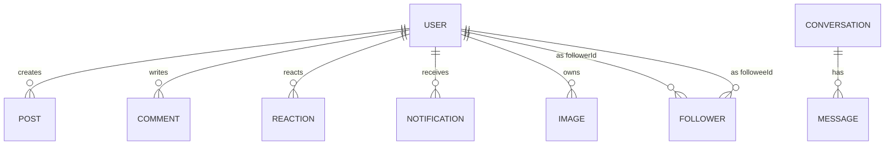

# Chatty Backend — Project Map + Data Model (Reference)

> Generated from `chatty-backend-develop.zip`  
> Date: January 24, 2026

This file is the “reference sheet”: folder map, routes, Mongo collections, Redis keys, Socket.IO events, and Bull jobs.

---

## 1) Folder / module map (what lives where)

### 1.1 `src/` high-level tree (trimmed)

```text
src/
├── features/
│   ├── auth/
│   │   ├── controllers/
│   │   │   ├── test/
│   │   │   ├── current-user.ts
│   │   │   ├── password.ts
│   │   │   ├── signin.ts
│   │   │   ├── signout.ts
│   │   │   └── signup.ts
│   │   ├── interfaces/
│   │   │   └── auth.interface.ts
│   │   ├── models/
│   │   │   └── auth.schema.ts
│   │   ├── routes/
│   │   │   ├── authRoutes.ts
│   │   │   └── currentRoutes.ts
│   │   └── schemes/
│   │       ├── password.ts
│   │       ├── signin.ts
│   │       └── signup.ts
│   ├── chat/
│   │   ├── controllers/
│   │   │   ├── test/
│   │   │   ├── add-chat-message.ts
│   │   │   ├── add-message-reaction.ts
│   │   │   ├── delete-chat-message.ts
│   │   │   ├── get-chat-message.ts
│   │   │   └── update-chat-message.ts
│   │   ├── interfaces/
│   │   │   ├── chat.interface.ts
│   │   │   └── conversation.interface.ts
│   │   ├── models/
│   │   │   ├── chat.schema.ts
│   │   │   └── conversation.schema.ts
│   │   ├── routes/
│   │   │   └── chatRoutes.ts
│   │   └── schemes/
│   │       └── chat.ts
│   ├── comments/
│   │   ├── controllers/
│   │   │   ├── test/
│   │   │   ├── add-comment.ts
│   │   │   └── get-comments.ts
│   │   ├── interfaces/
│   │   │   └── comment.interface.ts
│   │   ├── models/
│   │   │   └── comment.schema.ts
│   │   ├── routes/
│   │   │   └── commentRoutes.ts
│   │   └── schemes/
│   │       └── comment.ts
│   ├── followers/
│   │   ├── controllers/
│   │   │   ├── test/
│   │   │   ├── block-user.ts
│   │   │   ├── follower-user.ts
│   │   │   ├── get-followers.ts
│   │   │   └── unfollow-user.ts
│   │   ├── interfaces/
│   │   │   └── follower.interface.ts
│   │   ├── models/
│   │   │   └── follower.schema.ts
│   │   └── routes/
│   │       └── followerRoutes.ts
│   ├── images/
│   │   ├── controllers/
│   │   │   ├── test/
│   │   │   ├── add-image.ts
│   │   │   ├── delete-image.ts
│   │   │   └── get-images.ts
│   │   ├── interfaces/
│   │   │   └── image.interface.ts
│   │   ├── models/
│   │   │   └── image.schema.ts
│   │   ├── routes/
│   │   │   └── imageRoutes.ts
│   │   └── schemes/
│   │       └── images.ts
│   ├── notifications/
│   │   ├── controllers/
│   │   │   ├── test/
│   │   │   ├── delete-notification.ts
│   │   │   ├── get-notifications.ts
│   │   │   └── update-notification.ts
│   │   ├── interfaces/
│   │   │   └── notification.interface.ts
│   │   ├── models/
│   │   │   └── notification.schema.ts
│   │   └── routes/
│   │       └── notificationRoutes.ts
│   ├── post/
│   │   ├── controllers/
│   │   │   ├── test/
│   │   │   ├── create-post.ts
│   │   │   ├── delete-post.ts
│   │   │   ├── get-posts.ts
│   │   │   └── update-post.ts
│   │   ├── interfaces/
│   │   │   └── post.interface.ts
│   │   ├── models/
│   │   │   └── post.schema.ts
│   │   ├── routes/
│   │   │   └── postRoutes.ts
│   │   └── schemes/
│   │       └── post.schemes.ts
│   ├── reactions/
│   │   ├── controllers/
│   │   │   ├── test/
│   │   │   ├── add-reactions.ts
│   │   │   ├── get-reactions.ts
│   │   │   └── remove-reaction.ts
│   │   ├── interfaces/
│   │   │   └── reaction.interface.ts
│   │   ├── models/
│   │   │   └── reaction.schema.ts
│   │   ├── routes/
│   │   │   └── reactionRoutes.ts
│   │   └── schemes/
│   │       └── reactions.ts
│   └── user/
│       ├── controllers/
│       │   ├── test/
│       │   ├── change-password.ts
│       │   ├── get-profile.ts
│       │   ├── search-user.ts
│       │   ├── update-basic-info.ts
│       │   └── update-settings.ts
│       ├── interfaces/
│       │   └── user.interface.ts
│       ├── models/
│       │   └── user.schema.ts
│       ├── routes/
│       │   ├── healthRoutes.ts
│       │   └── userRoutes.ts
│       └── schemes/
│           └── info.ts
├── mocks/
│   ├── auth.mock.ts
│   ├── chat.mock.ts
│   ├── followers.mock.ts
│   ├── image.mock.ts
│   ├── notification.mock.ts
│   ├── post.mock.ts
│   ├── reactions.mock.ts
│   └── user.mock.ts
├── shared/
│   ├── globals/
│   │   ├── decorators/
│   │   │   └── joi-validation.decorators.ts
│   │   └── helpers/
│   │       ├── auth-middleware.ts
│   │       ├── cloudinary-upload.ts
│   │       ├── error-handler.ts
│   │       └── helpers.ts
│   ├── services/
│   │   ├── db/
│   │   │   ├── auth.service.ts
│   │   │   ├── block-user.service.ts
│   │   │   ├── chat.service.ts
│   │   │   ├── comment.service.ts
│   │   │   ├── follower.service.ts
│   │   │   ├── image.service.ts
│   │   │   ├── notification.service.ts
│   │   │   ├── post.service.ts
│   │   │   ├── reaction.service.ts
│   │   │   └── user.service.ts
│   │   ├── emails/
│   │   │   ├── templates/
│   │   │   └── mail.transport.ts
│   │   ├── queues/
│   │   │   ├── auth.queue.ts
│   │   │   ├── base.queue.ts
│   │   │   ├── blocked.queue.ts
│   │   │   ├── chat.queue.ts
│   │   │   ├── comment.queue.ts
│   │   │   ├── email.queue.ts
│   │   │   ├── follower.queue.ts
│   │   │   ├── image.queue.ts
│   │   │   ├── notification.queue.ts
│   │   │   ├── post.queue.ts
│   │   │   ├── reaction.queue.ts
│   │   │   └── user.queue.ts
│   │   └── redis/
│   │       ├── base.cache.ts
│   │       ├── comment.cache.ts
│   │       ├── follower.cache.ts
│   │       ├── message.cache.ts
│   │       ├── post.cache.ts
│   │       ├── reaction.cache.ts
│   │       ├── redis.connection.ts
│   │       └── user.cache.ts
│   ├── sockets/
│   │   ├── chat.ts
│   │   ├── follower.ts
│   │   ├── image.ts
│   │   ├── notification.ts
│   │   ├── post.ts
│   │   └── user.ts
│   └── workers/
│       ├── auth.worker.ts
│       ├── blocked.worker.ts
│       ├── chat.worker.ts
│       ├── comment.worker.ts
│       ├── email.worker.ts
│       ├── follower.worker.ts
│       ├── image.worker.ts
│       ├── notification.worker.ts
│       ├── post.worker.ts
│       ├── reaction.worker.ts
│       └── user.worker.ts
├── app.ts
├── config.ts
├── routes.ts
├── seeds.ts
├── setupDatabase.ts
└── setupServer.ts
```

### 1.2 How the code is organized

- `src/features/*` = feature modules (controllers, routes, models, interfaces, services, tests)
- `src/shared/*` = shared infrastructure
  - `globals/` decorators, helpers (auth middleware, error handler, etc.)
  - `services/redis/` Redis caches
  - `services/db/` DB services (Mongo queries, domain logic)
  - `services/queues/` Bull queues
  - `workers/` Bull processors
  - `sockets/` Socket.IO handlers + emitters
- `src/setupServer.ts` = Express middleware setup + socket.io bootstrap
- `src/routes.ts` = route registration (BASE_PATH `/api/v1`)

---

## 2) HTTP API routes (what endpoints exist)

### 2.1 Non-versioned routes (no `/api/v1` prefix)

| Method | Path | Notes |
|---|---|---|
| GET | `/health` | simple health check |
| GET | `/env` | prints environment (debug) |
| GET | `/instance` | calls `EC2_URL` and prints instance id |
| GET | `/fibo/:num` | CPU test route |
| GET | `/queues` | Bull Board UI |

### 2.2 Versioned routes (`/api/v1/*`)

### auth

| Method | Path (under `/api/v1`) | Source |
|---|---|---|
| GET | `/currentuser` | `currentRoutes.ts:13` |
| GET | `/signout` | `authRoutes.ts:24` |
| POST | `/forgot-password` | `authRoutes.ts:17` |
| POST | `/reset-password/:token` | `authRoutes.ts:18` |
| POST | `/signin` | `authRoutes.ts:16` |
| POST | `/signup` | `authRoutes.ts:15` |

### chat

| Method | Path (under `/api/v1`) | Source |
|---|---|---|
| GET | `/chat/message/conversation-list` | `chatRoutes.ts:17` |
| GET | `/chat/message/user/:receiverId` | `chatRoutes.ts:18` |
| POST | `/chat/message` | `chatRoutes.ts:19` |
| POST | `/chat/message/add-chat-users` | `chatRoutes.ts:20` |
| POST | `/chat/message/remove-chat-users` | `chatRoutes.ts:21` |
| PUT | `/chat/message/mark-as-read` | `chatRoutes.ts:22` |
| PUT | `/chat/message/reaction` | `chatRoutes.ts:23` |

### comments

| Method | Path (under `/api/v1`) | Source |
|---|---|---|
| GET | `/post/comments/:postId` | `commentRoutes.ts:14` |
| GET | `/post/commentsnames/:postId` | `commentRoutes.ts:15` |
| GET | `/post/single/comment/:postId/:commentId` | `commentRoutes.ts:16` |
| POST | `/post/comment` | `commentRoutes.ts:18` |

### followers

| Method | Path (under `/api/v1`) | Source |
|---|---|---|
| GET | `/user/followers/:userId` | `followerRoutes.ts:17` |
| GET | `/user/following` | `followerRoutes.ts:16` |
| PUT | `/user/block/:followerId` | `followerRoutes.ts:21` |
| PUT | `/user/follow/:followerId` | `followerRoutes.ts:19` |
| PUT | `/user/unblock/:followerId` | `followerRoutes.ts:22` |
| PUT | `/user/unfollow/:followeeId/:followerId` | `followerRoutes.ts:20` |

### images

| Method | Path (under `/api/v1`) | Source |
|---|---|---|
| DELETE | `/images/:imageId` | `imageRoutes.ts:18` |
| DELETE | `/images/background/:bgImageId` | `imageRoutes.ts:19` |
| GET | `/images/:userId` | `imageRoutes.ts:15` |
| POST | `/images/background` | `imageRoutes.ts:17` |
| POST | `/images/profile` | `imageRoutes.ts:16` |

### notifications

| Method | Path (under `/api/v1`) | Source |
|---|---|---|
| DELETE | `/notification/:notificationId` | `notificationRoutes.ts:17` |
| GET | `/notifications` | `notificationRoutes.ts:15` |
| PUT | `/notification/:notificationId` | `notificationRoutes.ts:16` |

### post

| Method | Path (under `/api/v1`) | Source |
|---|---|---|
| DELETE | `/post/:postId` | `postRoutes.ts:28` |
| GET | `/post/all/:page` | `postRoutes.ts:16` |
| GET | `/post/images/:page` | `postRoutes.ts:17` |
| GET | `/post/videos/:page` | `postRoutes.ts:18` |
| POST | `/post` | `postRoutes.ts:20` |
| POST | `/post/image/post` | `postRoutes.ts:21` |
| POST | `/post/video/post` | `postRoutes.ts:22` |
| PUT | `/post/:postId` | `postRoutes.ts:24` |
| PUT | `/post/image/:postId` | `postRoutes.ts:25` |
| PUT | `/post/video/:postId` | `postRoutes.ts:26` |

### reactions

| Method | Path (under `/api/v1`) | Source |
|---|---|---|
| GET | `/post/reactions/:postId` | `reactionRoutes.ts:15` |
| GET | `/post/reactions/username/:username` | `reactionRoutes.ts:21` |
| POST | `/post/reaction` | `reactionRoutes.ts:23` |

### user

| Method | Path (under `/api/v1`) | Source |
|---|---|---|
| GET | `/env` | `healthRoutes.ts:24` |
| GET | `/fibo/:num` | `healthRoutes.ts:46` |
| GET | `/health` | `healthRoutes.ts:16` |
| GET | `/instance` | `healthRoutes.ts:32` |
| GET | `/user/all/:page` | `userRoutes.ts:17` |
| GET | `/user/profile` | `userRoutes.ts:18` |
| GET | `/user/profile/:userId` | `userRoutes.ts:19` |
| GET | `/user/profile/posts/:username/:userId/:uId` | `userRoutes.ts:20` |
| GET | `/user/profile/search/:query` | `userRoutes.ts:22` |
| GET | `/user/profile/user/suggestions` | `userRoutes.ts:21` |
| PUT | `/user/profile/basic-info` | `userRoutes.ts:25` |
| PUT | `/user/profile/change-password` | `userRoutes.ts:24` |
| PUT | `/user/profile/settings` | `userRoutes.ts:27` |
| PUT | `/user/profile/social-links` | `userRoutes.ts:26` |


---

## 3) Socket.IO: events + how realtime works

### 3.1 What the client sends vs what server emits

**Client → server events (from socket handlers):**
- Chat: `join room`
- Post: `reaction`, `comment`
- User: `setup`, `block user`, `unblock user`
- Follower: `unfollow user`

**Server → client events (emitted across the app):**
- Posts: `add post`, `update post`, `delete post`
- Reactions/Comments: `update like`, `update comment`
- Followers: `add follower`, `remove follower`
- Notifications: `insert notification`, `update notification`, `delete notification`
- Chat: `message received`, `chat list`, `message reaction`, `message read`, `add chat users`
- User presence: `user online`, `blocked user id`, `unblocked user id`
- Images: `delete image`

> Scaling note: Socket.IO uses Redis adapter (`@socket.io/redis-adapter`) with pub/sub clients, so events propagate across Node instances.

### 3.2 Recommended “interview” explanation

“I keep UI reactive using Socket.IO. Controllers update cache and immediately emit events; workers/services emit follow-up events (like notifications) once DB work completes. With Redis adapter, realtime works even when the server scales horizontally.”

---

## 4) Bull queues & job contracts (async processing)

### 4.1 Job registry (from queue constructors)

| Queue | Job name | Concurrency | Worker callback |
|---|---|---:|---|
| `auth.queue` | `addAuthUserToDB` | 5 | `authWorker.addAuthUserToDB` |
| `blocked.queue` | `addBlockedUserToDB` | 5 | `blockedUserWorker.addBlockedUserToDB` |
| `blocked.queue` | `removeBlockedUserFromDB` | 5 | `blockedUserWorker.addBlockedUserToDB` |
| `chat.queue` | `addChatMessageToDB` | 5 | `chatWorker.addChatMessageToDB` |
| `chat.queue` | `markMessageAsDeletedInDB` | 5 | `chatWorker.markMessageAsDeleted` |
| `chat.queue` | `markMessagesAsReadInDB` | 5 | `chatWorker.markMessagesAsReadInDB` |
| `chat.queue` | `updateMessageReaction` | 5 | `chatWorker.updateMessageReaction` |
| `comment.queue` | `addCommentToDB` | 5 | `commentWorker.addCommentToDB` |
| `email.queue` | `changePassword` | 5 | `emailWorker.addNotificationEmail` |
| `email.queue` | `commentsEmail` | 5 | `emailWorker.addNotificationEmail` |
| `email.queue` | `directMessageEmail` | 5 | `emailWorker.addNotificationEmail` |
| `email.queue` | `followersEmail` | 5 | `emailWorker.addNotificationEmail` |
| `email.queue` | `forgotPasswordEmail` | 5 | `emailWorker.addNotificationEmail` |
| `email.queue` | `reactionsEmail` | 5 | `emailWorker.addNotificationEmail` |
| `follower.queue` | `addFollowerToDB` | 5 | `followerWorker.addFollowerToDB` |
| `follower.queue` | `removeFollowerFromDB` | 5 | `followerWorker.removeFollowerFromDB` |
| `image.queue` | `addImageToDB` | 5 | `imageWorker.addImageToDB` |
| `image.queue` | `addUserProfileImageToDB` | 5 | `imageWorker.addUserProfileImageToDB` |
| `image.queue` | `removeImageFromDB` | 5 | `imageWorker.removeImageFromDB` |
| `image.queue` | `updateBGImageInDB` | 5 | `imageWorker.updateBGImageInDB` |
| `notification.queue` | `deleteNotification` | 5 | `notificationWorker.deleteNotification` |
| `notification.queue` | `updateNotification` | 5 | `notificationWorker.updateNotification` |
| `post.queue` | `addPostToDB` | 5 | `postWorker.savePostToDB` |
| `post.queue` | `deletePostFromDB` | 5 | `postWorker.deletePostFromDB` |
| `post.queue` | `updatePostInDB` | 5 | `postWorker.updatePostInDB` |
| `reaction.queue` | `addReactionToDB` | 5 | `reactionWorker.addReactionToDB` |
| `reaction.queue` | `removeReactionFromDB` | 5 | `reactionWorker.removeReactionFromDB` |
| `user.queue` | `addUserToDB` | 5 | `userWorker.addUserToDB` |
| `user.queue` | `updateBasicInfoInDB` | 5 | `userWorker.updateUserInfo` |
| `user.queue` | `updateNotificationSettings` | 5 | `userWorker.updateNotificationSettings` |
| `user.queue` | `updateSocialLinksInDB` | 5 | `userWorker.updateSocialLinks` |

### 4.2 How to explain the job payload fields

Some jobs use generic keys:

- `key` → usually a single id (e.g. conversationId, postId)
- `keyOne`, `keyTwo` → pair ids (actor/target), used by delete/block/unfollow jobs
- `type` → “mode” (e.g. block vs unblock)

In interviews, call them `actorId` and `targetId` for clarity.

---

## 5) MongoDB data model (collections + key fields)

The code uses Mongoose models; below are the fields as defined in schemas.

### 5.1 `Auth` (authentication credentials)

**Collection:** `Auth` (`src/features/auth/models/auth.schema.ts`)  
Key fields:
- `username` (unique)
- `email` (unique, lowercase, trimmed)
- `password` (hashed)
- `avatarColor`, `profilePicture`
- `createdAt`

### 5.2 `User` (profile + settings)

**Collection:** `User` (`src/features/user/models/user.schema.ts`)  
Key fields:
- identity: `authId`, `username`, `email`, `uId` (numeric), `profilePicture`, `avatarColor`
- profile: `postsCount`, `followersCount`, `followingCount`, `quote`, `work`, `school`, `location`, `bgImageId`
- social: `blocked: [ObjectId]`, `blockedBy: [ObjectId]`, `notifications: { messages, reactions, comments, follows }`
- timestamps

Indexes:
- `email` unique, `username` unique

### 5.3 `Post`

**Collection:** `Post` (`src/features/post/models/post.schema.ts`)  
Key fields:
- author: `userId`, `username`, `email`, `avatarColor`, `profilePicture`
- content: `post`, `bgColor`, `feelings`, `privacy`
- media: `gifUrl`, `imgVersion`, `imgId`, `videoVersion`, `videoId`
- aggregates: `commentsCount`, `reactions` object
- `createdAt`

Indexes:
- `userId`, `createdAt`

### 5.4 `Comment`

**Collection:** `Comment` (`src/features/comments/models/comment.schema.ts`)  
Key fields:
- `postId`
- author: `userTo`, `username`, `avatarColor`, `profilePicture`
- `comment` (text)
- `createdAt`

Indexes:
- `postId`

### 5.5 `Reaction`

**Collection:** `Reaction` (`src/features/reactions/models/reaction.schema.ts`)  
Key fields:
- `postId`
- `username`, `avatarColor`, `profilePicture`
- `type` (reaction type)
- `createdAt`

Indexes:
- `postId`

### 5.6 `Follower`

**Collection:** `Follower` (`src/features/followers/models/follower.schema.ts`)  
Key fields:
- `followerId` (who follows)
- `followeeId` (who is followed)
- `createdAt`

Indexes:
- `followerId`, `followeeId`

### 5.7 `Notification`

**Collection:** `Notification` (`src/features/notifications/models/notification.schema.ts`)  
Key fields:
- `userTo` (receiver)
- `userFrom` (actor)
- `message`, `notificationType`, `entityId`
- `read` (boolean)
- `createdAt`

Indexes:
- `userTo`

### 5.8 `Chat` and `Conversation`

**Collection:** `Conversation` (`conversation.schema.ts`)
- `senderId`, `receiverId`

**Collection:** `Message` (`chat.schema.ts`)
- `conversationId`
- sender fields: `senderId`, `senderUsername`, `senderAvatarColor`, `senderProfilePicture`
- receiver fields: `receiverId`, `receiverUsername`, `receiverAvatarColor`, `receiverProfilePicture`
- message: `body`, `gifUrl`, `selectedImage`
- flags: `isRead`, `deleteForEveryone`, `deleteForMe`
- `reaction: []`
- `createdAt`

Indexes:
- Conversation: `senderId`, `receiverId`
- Message: `conversationId`

### 5.9 `Image`

**Collection:** `Image` (`src/features/images/models/image.schema.ts`)
- `userId`, `imgId`, `imgVersion`
- `createdAt`

Index:
- `userId`

---

## 6) Mermaid ER diagram (Mongo collections)



---

## 7) Redis “data tree” (keys + data types)

### 7.1 Key naming and types (from cache classes)

| Redis key pattern | Type | Stored data | Where used |
|---|---|---|---|
| `users:{userId}` | HASH | user profile fields + counts + settings | `UserCache`, follower/reaction/comment flows |
| `user` | ZSET | members: `users:{userId}` keys, score: `uId` | `UserCache` pagination |
| `posts:{postId}` | HASH | post fields + counters | `PostCache`, `CommentCache`, `ReactionCache` |
| `post` | ZSET | members: `posts:{postId}`, score: `uId` | `PostCache` feed/pagination |
| `comments:{postId}` | LIST | comment JSON strings | `CommentCache` |
| `reactions:{postId}` | LIST | reaction JSON strings | `ReactionCache` |
| `followers:{userId}` | LIST | follower user JSON | `FollowerCache` |
| `following:{userId}` | LIST | followee user JSON | `FollowerCache` |
| `chatList:{userId}` | LIST | `{ receiverId, conversationId }` | `MessageCache` |
| `messages:{conversationId}` | LIST | message JSON strings | `MessageCache` |
| `chatUsers` | LIST | active chat users | `MessageCache` |

### 7.2 Redis keys diagram

```mermaid
flowchart TB
  subgraph Redis
    U[users:{id} HASH]
    ZU[user ZSET]
    P[posts:{postId} HASH]
    ZP[post ZSET]
    C[comments:{postId} LIST]
    R[reactions:{postId} LIST]
    F1[followers:{userId} LIST]
    F2[following:{userId} LIST]
    CL[chatList:{userId} LIST]
    M[messages:{conversationId} LIST]
  end
  ZU --> U
  ZP --> P
```

### 7.3 Eviction / growth warning (important)

This project does **not** set TTLs on these keys. Without Redis `maxmemory` + eviction policy, lists can grow forever (especially chat messages).

---

## 8) Deployment folder (Terraform) — quick note

The repo includes a `deployment/` folder with Terraform modules for AWS networking (VPC, subnets, route tables, NAT, EIPs) and userdata scripts.

```text
deployment/
├── userdata/
│   ├── delete-asg.sh
│   ├── update-env-file.sh
│   └── user-data.sh
├── 1-variables.tf
├── 10-private_route_table.tf
├── 11-security_groups.tf
├── 12-alb_target_group.tf
├── 13-route53.tf
├── 14-route53_certificate.tf
├── 15-alb.tf
├── 16-alb_route53_alias.tf
├── 17-iam_ec2_roles.tf
├── 18-elasticache.tf
├── 19-ami-data.tf
├── 2-version.tf
├── 20-ec2_launch_config.tf
├── 21-asg.tf
├── 22-asg_policy.tf
├── 23-bastion_hosts.tf
├── 24-s3.tf
├── 25-iam_code_deploy.tf
├── 26-code_deploy.tf
├── 3-main.tf
├── 4-vpc.tf
├── 5-subnets.tf
├── 6-igw.tf
├── 7-public_route_table.tf
├── 8-elastic_ips.tf
└── 9-nat_gateway.tf
```

---

## 9) Small issues spotted (good interview “learning” points)

- Missing dependencies: `xss-clean` and `express-mongo-sanitize` are imported in `setupServer.ts` but not present in `package.json` in this zip (you’d add them).
- `blocked.queue.ts` wires `removeBlockedUserFromDB` to the add worker callback (likely a bug).
- Many Socket.IO emits are global broadcasts; can be optimized using per-user rooms.
- No Redis TTL/trim; add them to control memory.

---

## 10) Quick “how to present this project”

1. **Architecture**: Express + Mongo + Redis + Bull + Socket.IO  
2. **Why**: fast UX + realtime + async reliability  
3. **How**: cache write-first + queue DB writes + socket emits  
4. **Tradeoffs**: eventual consistency + cache growth + broadcast fanout  
5. **Improvements**: rooms + TTL + dedicated workers + shared Redis clients
